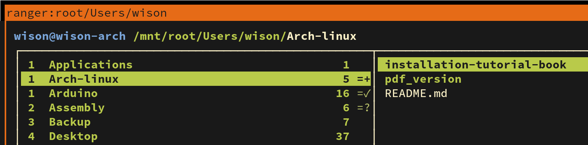

# Access Apple File System

In 2017, Apple changed the default filesystem on their **`macOS`** (High Sierra and above) 
to **`APFS`**, the `Apple File System`. It replaced `HFS+`.

For safety reason, you can use `apfs-fuse` to mount your MacOS drive within the read-only mode.

- Install

    ```bash
    sudo pacman -Sy fuse3 zlib bzip2 cmake
    ```

</br>

- Compile

    ```bash
    git clone https://github.com/sgan81/apfs-fuse.git
    cd apfs-fuse/
    git submodule init
    git submodule update

    mkdir build && cd build
    cmake ..
    make
    sudo make install
    ```

</br>

- Mount and umount

    ```bash
    # Mount with `allow_other` (can access) option
    # Plz replace the `sdXX` to your real device
    sudo apfs-fuse -o allow_other /dev/sdXX /mnt
    ```

    

    </br>

    ```bash
    # Unmount
    sudo umount /mnt
    ```

