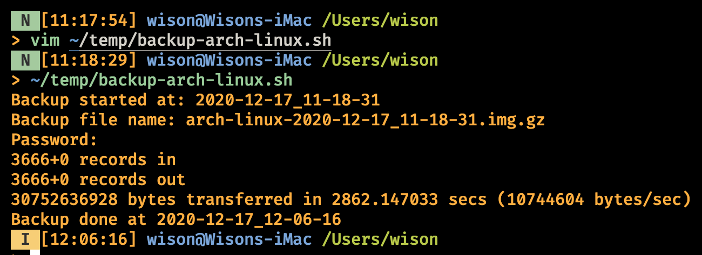

# Backup and restore

- Backup

    Create the backup script with following content:

    ```bash
    #!/bin/bash
    echo "Backup started at: $(date +'%Y-%m-%d_%H-%M-%S')"
    BACKUP_FILE_NAME="arch-linux-$(date +'%Y-%m-%d_%H-%M-%S').img.gz"
    echo "Backup file name: $BACKUP_FILE_NAME"
    sudo dd if=/dev/disk2 bs=8m | gzip -c > $BACKUP_FILE_NAME
    echo "Backup done at $(date +'%Y-%m-%d_%H-%M-%S')"
    ```

    Of course, you need to change something above which match your real case:

        - `BACKUP_FILE_NAME`, change to your prefer name (with path)

        - `/dev/disk2`, change to your real dev name

    In my case, I backup the `32GB` USB to `.img.gz`, it takes around `47 mins` and
    the compress size is `14GB`.

    

    ```bash
    14G 17 Dec 12:06 arch-linux-2020-12-17_11-18-31.img.gz
    ```

</br>

- Restore

    Prepare your USB, and make sure the size should be equal or great than your original 
    backup USB size.
    
    Better to remove all the partitions before you restore, I think it can make sure the bootloader
    works fine. (not 100% sure)

    Then create the restore script with the folling content:

    ```bash
    #!/bin/bash
    echo "Restore started at: $(date +'%Y-%m-%d_%H-%M-%S')"
    RESTORE_FILE_NAME="arch-linux-$(date +'%Y-%m-%d_%H-%M-%S').img.gz"
    echo "Restore file name: $RESTORE_FILE_NAME"
    sudo bash -c 'gunzip -c ${RESTORE_FILE_NAME} | sudo dd of=/dev/disk2 bs=8m'
    echo "Restore done at $(date +'%Y-%m-%d_%H-%M-%S')"
    ```
