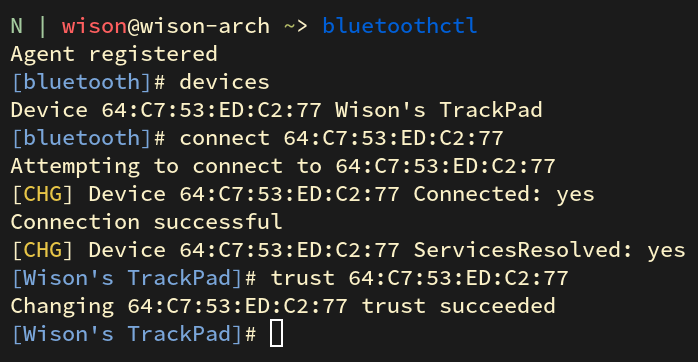
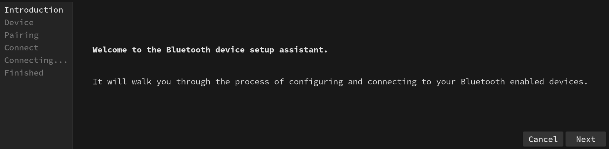
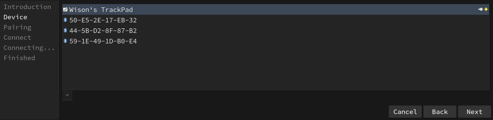
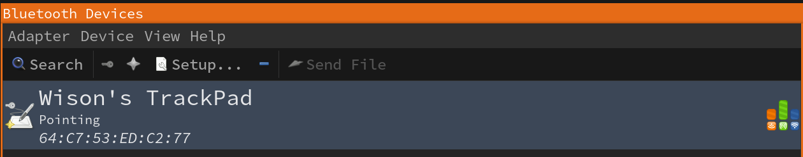
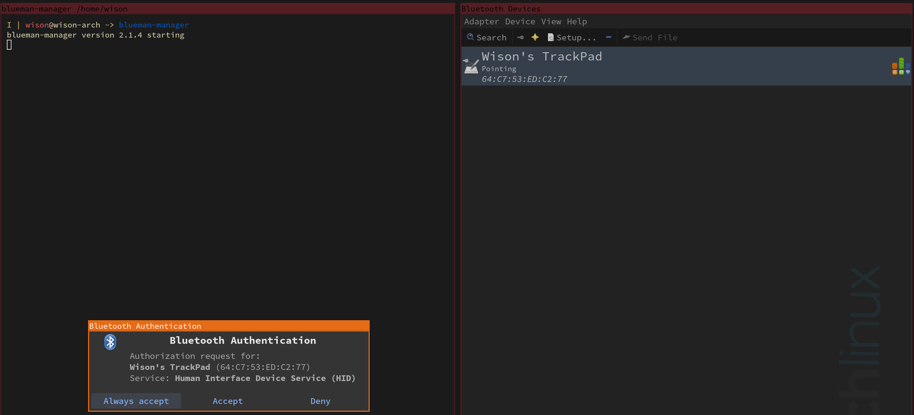

# Bluetooth support

- Install

    ```bash
    sudo pacman --sync --refresh bluez bluez-utils blueman
    ```

</br>

- Enable/start service

    ```bash
    # If you want auto bluetooth service
    sudo systemctl enable bluetooth.service

    # You can restart it manually anytime you need input
    sudo systemctl restart bluetooth.service
    sudo systemctl status bluetooth.service
    ```

</br>

- Make sure `rfkill` not block your bluetooth adapter

    `rfkill` a tool for enabling and disabling wireless device.

    ```bash
    sudo rfkill list

    # 0: hci0: bluetooth
    #       Soft blcoked: no
    #       Hard blcoked: no
    ```

    The case above means no block at all, that's fine. If you see it's blocked, then run the
    command below to unblock:

    ```bash
    sudo rfkill unblock bluetooth
    ````

</br>

- Scan and pair, then connect

    First, turn off your bluetooth device which want to connect to. Run `bluetoothctl`,
    then follow the steps below to connect:

    ```bash
    # Make sure turn on the bluetooth
    power on

    # Enable scan, after that, bluetooth devices show up there one by one
    scan on

    # Right now, turn on your bluetooth device, then wait for it to show up.
    # Hopefully, it shows its name directly which you can confirm that's your device.
    # If it doesn't, only show the MAC ID, then copy that Id and run the
    # command to confirm.
    info XX:XX:XX:XX:XX:XX

    # Once you confirm that your device, then do:
    pair XX:XX:XX:XX:XX:XX

    # After pairing, you can connect to it
    connect XX:XX:XX:XX:XX:XX

    # Optionally, you can trust it and it will auto connect next time
    trust XX:XX:XX:XX:XX:XX

    # Quit
    quit
    ```

    Below is the real example:

    

</br>


- Alternatively, you can use the `blueman-assistant` to do that in GUI mode:

    

    

    // Ignore the pair and connect steps......

    

</br>

- Another option, you can use `blueman-manger` directly which is another GUI tool:

    

    
