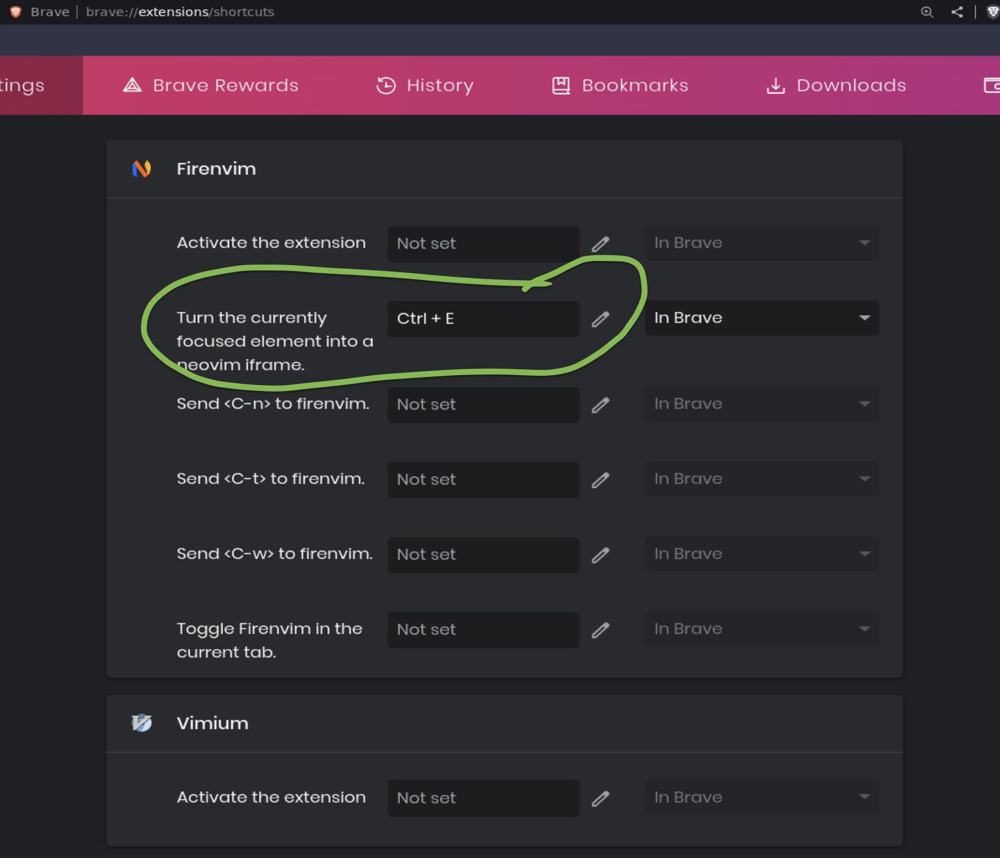

# firenvim plugins

- Install `firenvim` chrome plugin

    Open [`Chrome web store`](https://chrome.google.com/webstore) and search `firenvim`
    and install it.

    

    After that, you still need the following steps to finish the setup.

    </br>


- Install `firenvim` neovim plugin

    ```lua
    --[[
    If use `packer`

    Run neovim in browser

    Make sure read descrption in `my_firenvim.lua` if it doesn't work!!!
    Make sure read descrption in `my_firenvim.lua` if it doesn't work!!!
    Make sure read descrption in `my_firenvim.lua` if it doesn't work!!!
    --]]
    use {'glacambre/firenvim', run = function() vim.fn['firenvim#install'](0) end }

    --[[
    If use `VimPlug`
    --]]
    Plug 'glacambre/firenvim', { 'do': { _ -> firenvim#install(0) } }
    ```

    </br>

- Just make sure to install native mainfess (json file) correctly

    Open terminal and run the following `nvim` install command:

    ```bash
    nvim --headless "+call firenvim#install() | q"

    # Installed native manifest for chromium.
    # Installed native manifest for ungoogled-chromium.
    # Installed native manifest for librewolf.
    # Installed native manifest for opera.
    # Installed native manifest for brave.
    # Installed native manifest for vivaldi.
    # Installed native manifest for chrome-dev.
    # Installed native manifest for firefox.
    # Aborting installation for chrome-canary. Chrome Canary doesn't exist on Linux
    # Installed native manifest for chrome.
    # Installed native manifest for edge.⏎
    ```

    That `Installed native manifest for brave.` means it has been
	installed correctly and you should be able to print out the json file:

	```bash
	cat ~/.config/BraveSoftware/Brave-Browser/NativeMessagingHosts/firenvim.json

	# { "name": "firenvim", "description": "Turn your browser into a Neovim GUI.", "path": "/home/wison/.local/share/firenvim/firenvim", "type": "stdio", "allowed_origins": [ "chrome-extension://egpjdkipkomnmjhjmdamaniclmdlobbo/" ]}
	```

	</br>

    Then print out that  `path` file (`home/wison/.local/share/firenvim/firenvim`)
    to make sure `exec` points to the correct `nvim` binary:

    ```bash
    exec '/usr/bin/nvim'
    ```

    </br>

    Also, in that `path` file, the top lines should indicate that which temp
    folder that `firenvim` will use when running:

    ```bash
    mkdir -p /tmp//firenvim
    chmod 700 /tmp//firenvim
    cd /tmp//firenvim
    ```

    _**If not exists, run those commands to make sure it exists and with the correct
    permission!!!**_

    </br>


- Configure the shortcut

    Open `brave://extensions/shortcuts` and configure your shortcut like below:

    

    </br>

