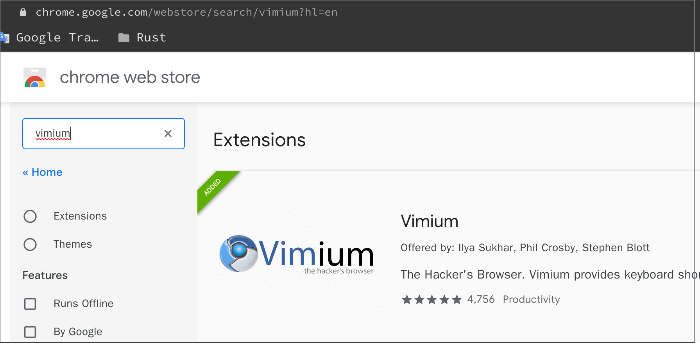
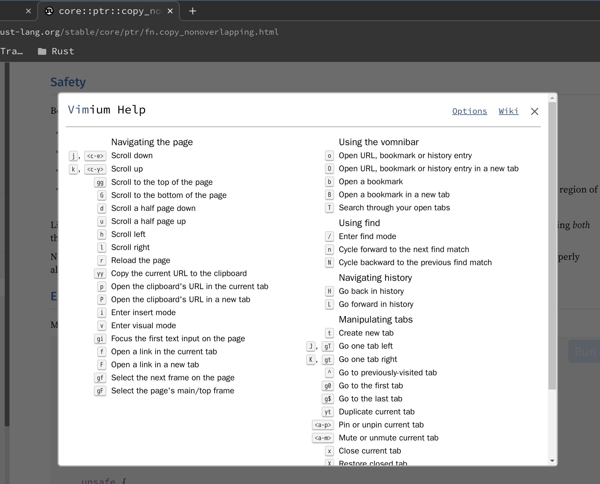
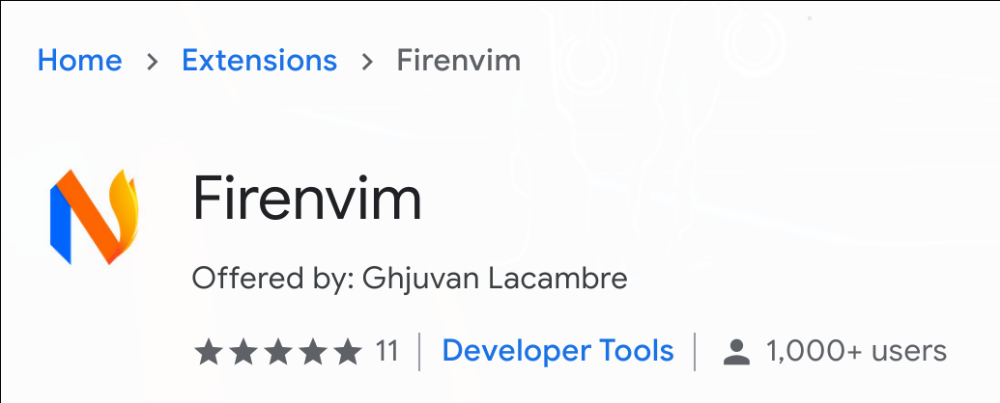
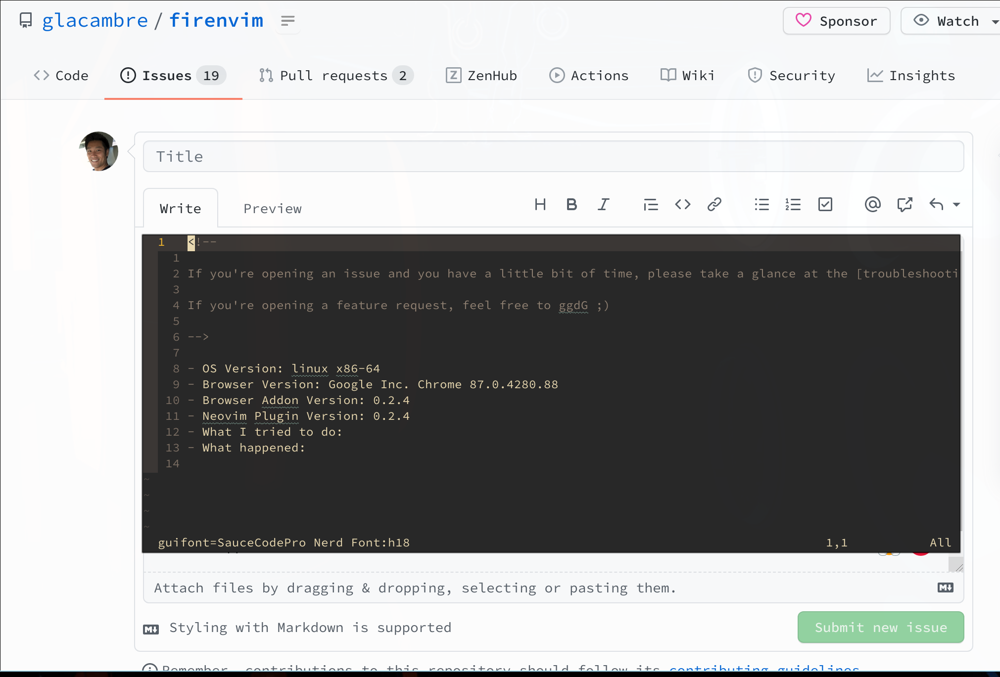

# Useful `vim` plugins


- **`vimium`**

    Open `Chrome web store` and search `vimium` and install it, enjoy the super convenience.

    

    

    And you can change your own kep mapping like this:

    ```bash
    map h previousTab
    map l nextTab
    ```

</br>

- **`firenvim`**

    `firenvim` allows you to use `nvim` inside the browser!!!

    - Install `firenvim`

        ```vim
        Plug 'glacambre/firenvim', { 'do': { _ -> firenvim#install(0) } }
        ```

        </br>

    - Install `firenvim` chrome plugin
    
        Open `Chrome web store` and search `firenvim` and install it.

        

        </br>

    - `firenvim` settings:

        ```vim
        " ----------------------------------------------------------------------------
        " 'glacambre/firenvim'
        " ----------------------------------------------------------------------------
        let g:firenvim_config = { 
            \ 'globalSettings': {
                \ 'alt': 'all',
            \  },
            \ 'localSettings': {
                \ '.*': {
                    \ 'cmdline': 'neovim',
                    \ 'content': 'text',
                    \ 'priority': 0,
                    \ 'selector': 'textarea',
                    \ 'takeover': 'always',
                \ },
            \ }
        \ }
        
        " Disable `firenvim` for the particular webiste
        let fc = g:firenvim_config['localSettings']
        " let fc['https?://[^/]+\.co\.uk/'] = { 'takeover': 'never', 'priority': 1 }
        let fc['https?://twitter.com/'] = { 'takeover': 'never', 'priority': 1 }
        let fc['https?://twitter.tv/'] = { 'takeover': 'never', 'priority': 1 }
        
        
        " Change `firenvim` file type to enable syntax highlight, `coc` works perfectly
        " after this settings!!!
        autocmd BufEnter github.com_*.txt set filetype=markdown
        autocmd BufEnter txti.es_*.txt set filetype=typescript
        
        
        " Increase the font size to solve the `text too small` issue
        function! s:IsFirenvimActive(event) abort
            if !exists('*nvim_get_chan_info')
                return 0
            endif
            let l:ui = nvim_get_chan_info(a:event.chan)
            return has_key(l:ui, 'client') && has_key(l:ui.client, 'name') &&
              \ l:ui.client.name =~? 'Firenvim'
        endfunction
        
        function! OnUIEnter(event) abort
            if s:IsFirenvimActive(a:event)
                " Disable the status bar
                set laststatus=0
        
                " Increase the font size
                set guifont=SauceCodePro\ Nerd\ Font:h18
            endif
        endfunction
        
        autocmd UIEnter * call OnUIEnter(deepcopy(v:event))
        ```

        As you can see above, you need to run the `set guifont` command to fix the 
        `text too small` issue when running `firenvim` inside `Chrome`. The important
        thing is that:

        - This will work for `firenvim`:

            ```vim
            set guifont=SauceCodePro\ Nerd\ Font:h18
            ```

        - This will NOT work for `firenvim`:

            ```vim
            set guifont=SauceCodePro\ Nerd\ Font\ 18
            ```

        </br>

        

        The screenshot above shows the correct font setting when running `set guifont?`
        inside the `firenvim`.

        </br>

        Of course, you can change the window's height and width at any given time by
        running the commands below inside the `firenvim`:

        ```js
        # `yyy` is the column count
        :set columns=yyy

        # `xxx` is the line count
        :set lines=xxx

        # Query the current settings
        :set lines?
        :set columns?
        ```

        </br>

        After finishing write in `firenvim` and before you do the preview, make sure to run 
        `:w` or `:wq`. Otherwise, all your content will not save to the `<TextArea>` dom.

        </br>

        


        

