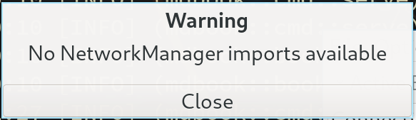
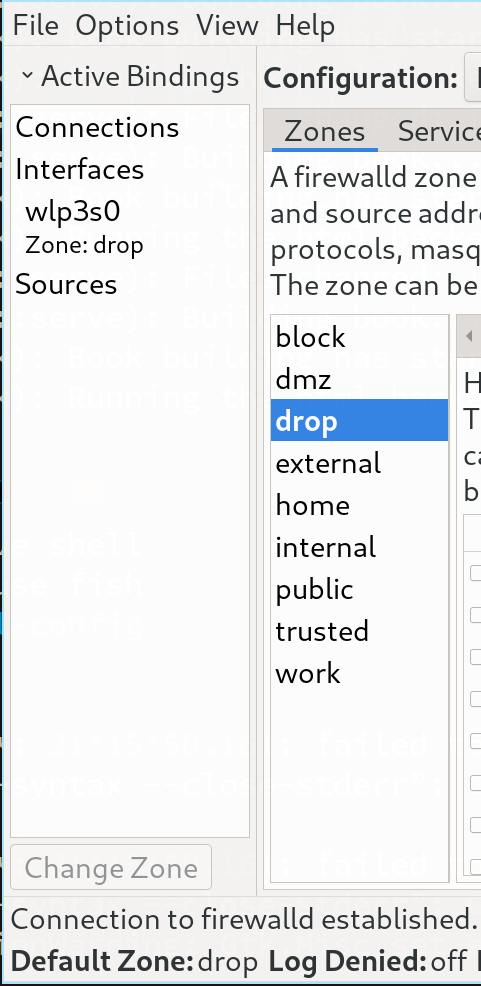

# Firewall

- Install

    ```bash
    sudo pacman -Sy firewalld ipset
    ```

    Enable the service and start it right now:

    ```bash
    sudo systemctl enable --now firewalld.service
    ```

</br>

- About the **`zone`** and **`service`**
    - What is a **`zone`**

        Long story short, a zone just like a `folder` contains predefined
        firewall rules.

    - Predefined **`services`**

        A service is a combination of port and/or protocol rules.

</br>

- Available **`zones`**

    Here only list the usual zone which user will use, for more details
    plz access the man page by running: `man firewalld.zones`.

    - **`drop`**

        The high secure option, no service open by default. Any incoming 
        network packets are dropped, there is no reply. Only outgoing 
        network connections are possible.

        ```bash
        sudo firewall-cmd --info-zone=drop
        #drop
        #  target: DROP
        #  icmp-block-inversion: no
        #  interfaces:
        #  sources:
        #  services:
        #  ports:
        #  protocols:
        #  forward: no
        #  masquerade: no
        #  forward-ports:
        #  source-ports:
        #  icmp-blocks:
        #  rich rules:
        ```

    - **`public`** (The default zone)

        For use in public areas. You do not trust the other computers
        on networks to not harm your computer. Only selected incoming
        connections are accepted.

        ```bash
        sudo firewall-cmd --info-zone=home
        #home
        #  target: default
        #  icmp-block-inversion: no
        #  interfaces:
        #  sources:
        #  services: dhcpv6-client mdns samba-client ssh
        #  ports:
        #  protocols:
        #  forward: no
        #  masquerade: no
        #  forward-ports:
        #  source-ports:
        #  icmp-blocks:
        #  rich rules:
        ```

</br>

- Configuration


    All configurations in `firewalld` separate in `runtime` and `permanent`, 
    `runtime` means only take effect from now on, but will not exists after
    reboot. If you run the command without `--permanent`, that means only 
    affect to the `runtime` configuration.

    ```bash
    # List the default zone
    firewall-cmd --get-default-zone

    # List all available zones
    firewall-cmd --get-zones

    # List all enabled services under current zone (`public` by default)
    sudo firewall-cmd --list-service
    sudo firewall-cmd --list-service --permanent

    # List all available services which you can add or remove
    firewall-cmd --get-services

    # Add the specified (enable) sevice to the current zone
    sudo firewall-cmd --add-service SERVICE_NAME_HERE
    sudo firewall-cmd --add-service SERVICE_NAME_HERE --permanent

    # Remove the specified sevice to the current zone
    sudo firewall-cmd --remove-service SERVICE_NAME_HERE
    sudo firewall-cmd --remove-service SERVICE_NAME_HERE --permanent

    # Usually, all setting commands are instancely.
    # But you can reload all the rules at any time.
    sudo firewall-cmd --reload
    ```

    </br>

    But you can config all the rules in a `GUI` tool:

    ```bash
    sudo firewall-config
    ```

</br>

- How to set `drop` as default zone and bind to the particular interface

    If you're **NOT** using `NetworkManager` to manger your `NIC`, then you should
    use `firewall-cmd` to change zone and bind to the particular `NIC`, otherwise
    NO firewall rules will applied to your network interface at all!!!

    How confirm that? If you run `sudo firewall-config` then you see this:

     

    Then all of your `NICs` aren NOT understand `NetworkManager` controll. Also, you can run
    the commands below to confirm as well:

    ```bash
    # If you got `public` that means you didn't setup
    firewall-cmd --get-default-zone

    # If you got nothing, that means no firewall zone apply to any inteface
    firewall-cmd --get-active-zone
    sudo firewall-cmd --list-interfaces
    ```

    </br>

    Here is how to setup:

    - Change default zone to `drop`:

        ```bash
        sudo firewall-cmd --set-default-zone=drop
        ```
    - Bind the WIFI interface to `drop` zone

        ```bash
        # Change the `wlp3s0` to your active WIFI interface!!!
        sudo firewall-cmd --permanent --change-zone=wlp3s0 --zone=drop
        ```
    - Reload `firewalld.service`

        ```bash
        sudo firewall-cmd --reload
        ```
        
        </br>

    How to prove the `--permament` option take effect?

    - File **`/etc/firewalld/firewalld.conf`** has the following settings:

        ```bash
        # default zone
        # The default zone used if an empty zone string is used.
        # Default: public
        DefaultZone=drop
        ```

    - File **`/etc/firewalld/zones/drop.xml`** has been added with the following settings:
    
        ```bash
        <?xml version="1.0" encoding="utf-8"?>
        <zone target="DROP">
          <short>Drop</short>
          <description>Unsolicited incoming network packets are dropped. Incoming packets that are related to outgoing network connections are accepted. Outgoing network connections are allowed.</description>
          <interface name="wlp3s0"/>
        </zone>
        ```

    Then you can confirm that the `drop` zone already applied to the particular
    (WIFI) network interface. Reboot and run the following commands to confirm
    it still works:

    ```bash
    firewall-cmd --get-default-zone
    # drop

    firewall-cmd --get-active-zone
    # drop
    #   interfaces: wlp3s0

    sudo firewall-cmd --list-interfaces
    # wlp3s0

    sudo firewall-cmd --list-services
    # Should show nothing, as `drop` zone has no open service port by default.
    ```

    Or run `sudo firewall-config` again, you should see the interface name
    already shown in the sidebar and highlighted the active zone name:

     

</br>

