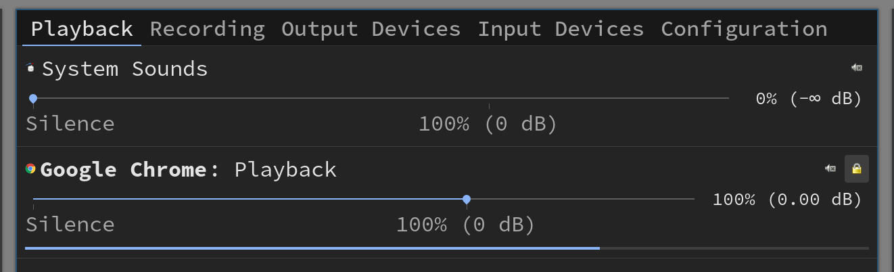

# Fix sound issue

- Install the packages below:

    ```bash
    sudo pacman -Sy pulseaudio alsa-utils

    # Reboot
    ```

</br>

- Run `alsamixer` and tune your sound setting

    - Press `F6` to choose your major audio playback device:

        

    - After selecting your correct audio playback device, 
    press `F3` to setup the `Playback` volume. Use left/right arrow key 
    to switch item and use Up/Down arrow key to change the volume. 

        

</br>

- You should be able to control with your `volume up/down` key on your keyboard

    If you installed `i3`, by default it has the volume keybindings like below:

    ```bash
    # ===========================================================================
    # Audio and volume control
    # ===========================================================================
    # Use pactl to adjust volume in PulseAudio.
    set $refresh_i3status killall -SIGUSR1 i3status
    bindsym XF86AudioRaiseVolume exec --no-startup-id pactl set-sink-volume @DEFAULT_SINK@ +10% && $refresh_i3status
    bindsym XF86AudioLowerVolume exec --no-startup-id pactl set-sink-volume @DEFAULT_SINK@ -10% && $refresh_i3status
    bindsym XF86AudioMute exec --no-startup-id pactl set-sink-mute @DEFAULT_SINK@ toggle && $refresh_i3status
    bindsym XF86AudioMicMute exec --no-startup-id pactl set-source-mute @DEFAULT_SOURCE@ toggle && $refresh_i3status
    ```

    It should work out-of-the-box.

</br>

- Optionally, you can install **`pavucontrol`** GUI volume control app

    ```bash
    sudo pacman -Sy pavucontrol
    ```

    It looks like this:


    

