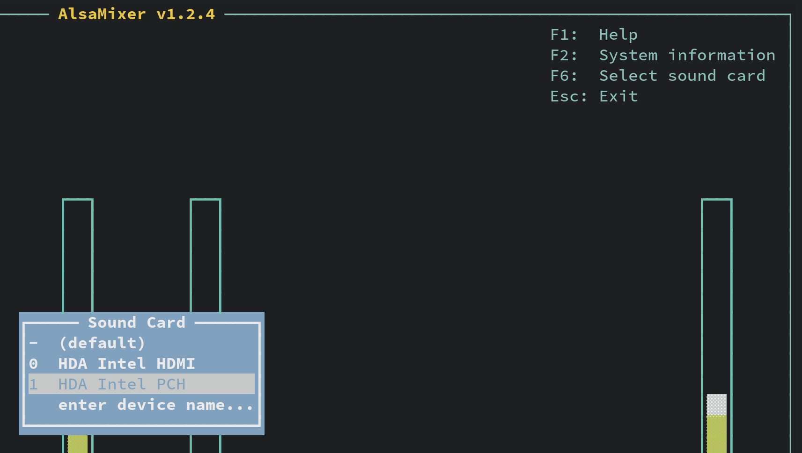
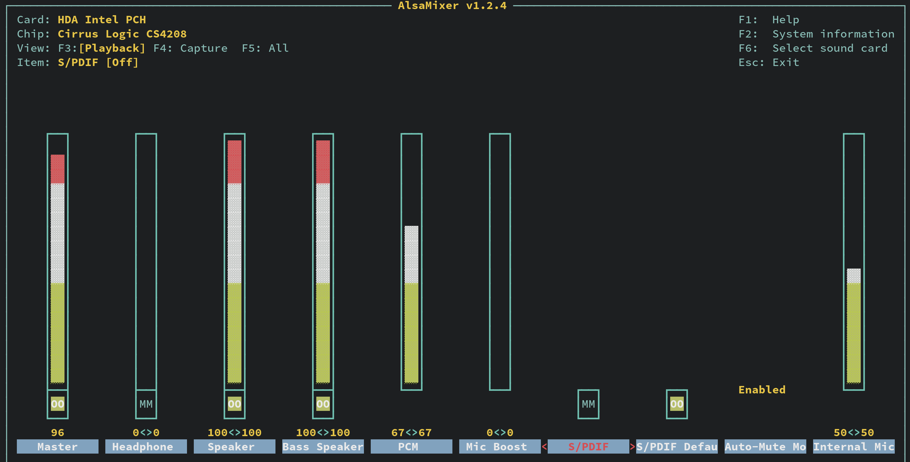
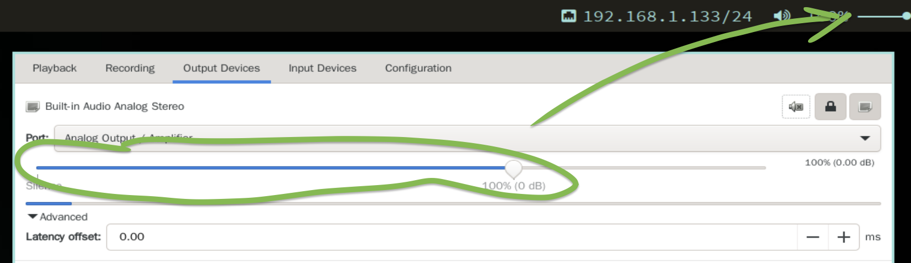

# Fix sound issue

- Install the packages below:

    ```bash
    doas apk --no-cache add pulseaudio pulseaudio-alas alsa-utils

    # Reboot
    ```

</br>

- `pulseaudio` is recommended NOT running in `system mode`

    Edit the configuration

    ```bash
    doas nvim /etc/conf.d/pulseaudio
    ```

    Make it looks like this:

    ```bash
    # Startup options
    PA_OPTS="--log-target=syslog --disallow-module-loading=1"
    PULSEAUDIO_SHOULD_NOT_GO_SYSTEMWIDE=false
    ```

    That `PULSEAUDIO_SHOULD_NOT_GO_SYSTEMWIDE=false` setting is important!!!

    </br>

    If you don't add that line, then you will see the following error in
    `/var/log/messages`:

    ```bash
     * Caching service dependencies ...                                                                                                                                                      [ ok ]
     * Please don't use system wide PulseAudio unless you read the
     * documentation available at http://www.freedesktop.org/wiki/Software/PulseAudio/Documentation/User/SystemWide/
     *
     * When you're done, please set the variable PULSEAUDIO_SHOULD_NOT_GO_SYSTEMWIDE in
     * /etc/conf.d/pulseaudio . Please remember that upstream does not support this mode
     * when used for standard desktop configurations.
     * ERROR: pulseaudio failed to start
    ```

    </br>

    From now on, you're good to go, run the daeomon and it should work:

    ```bash
    doas service pulseaudio restart

    # * Caching service dependencies ... [ ok ]
    # * Starting pulseaudio ... 
    ```

    </br>


- Run `alsamixer` and tune your sound setting

    - Press `F6` to choose your major audio playback device:

        

    - After selecting your correct audio playback device, 
    press `F3` to setup the `Playback` volume. Use left/right arrow key 
    to switch item and use Up/Down arrow key to change the volume. 

        

</br>

- Optionally, you can install **`pavucontrol`** GUI volume control app

    ```bash
    doas apk --no-cache add pavucontrol
    ```

    It looks like this:


    

    </br>


