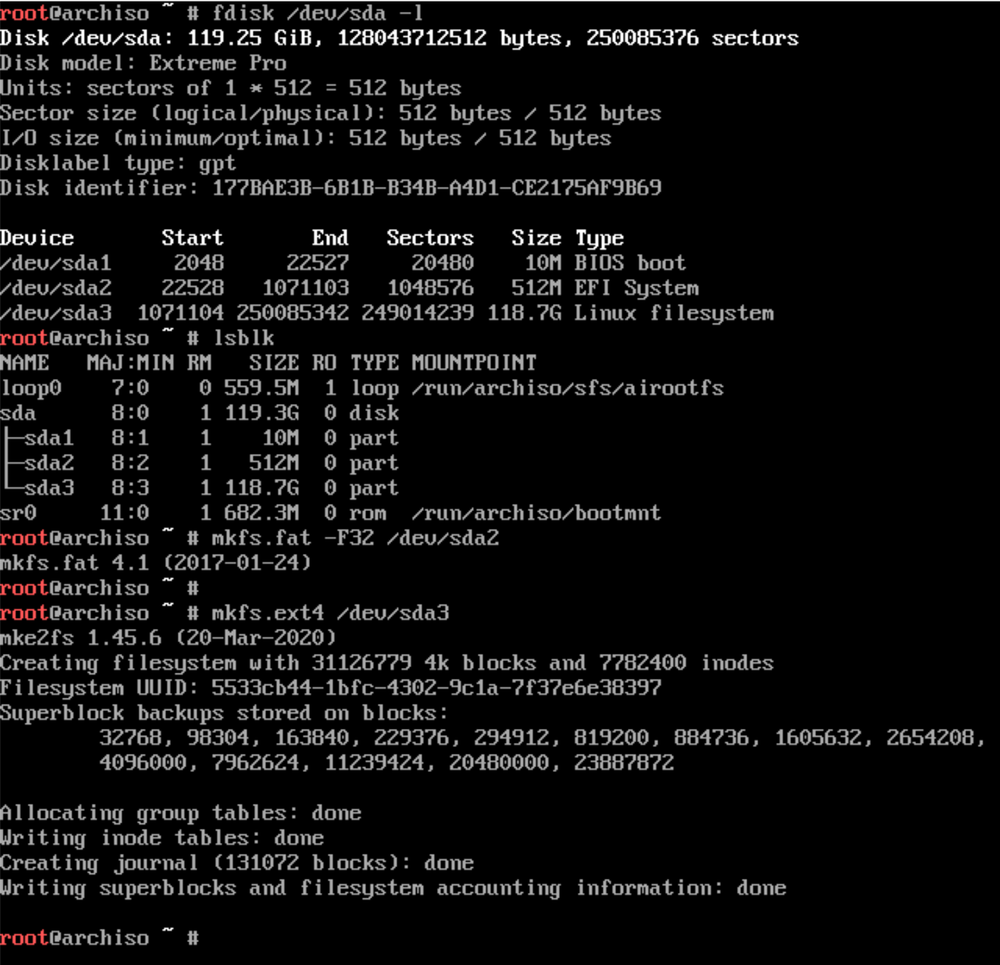

# Format partitions on USB

Do not format the **`/dev/sdX1`** partition. This is the **`BIOS/MBR`** partion!!!

Do not format the **`/dev/sdX1`** partition. This is the **`BIOS/MBR`** partion!!!

Do not format the **`/dev/sdX1`** partition. This is the **`BIOS/MBR`** partion!!!

</br>

```bash
# List block device, can help you to type correctly.
lsblk

# The `EFI` boot partition has to be `FAT` format
mkfs.fat -F32 /dev/sdX2

# The root partition, we use `EXT4` format
mkfs.ext4 /dev/sdX3
```

</br>


