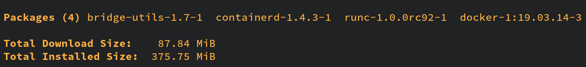
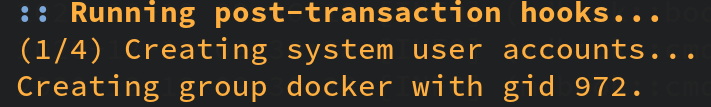

# Install docker

- Installation

    ```bash
    sudo pacman -S docker
    ```

    What components are installed be default?
    
    

</br>

- Handle `docker` as a service

    - Query status
        ```bash
        sudo systemctl status docker
        ```
    - Start
        ```bash
        sudo systemctl start docker
        ```
    - Stop
        ```bash
        sudo systemctl stop docker
        ```

    - Enable auto start
        ```bash
        sudo systemct enable docker
        ```

    - Disable auto start
        ```bash
        sudo systemct disable docker
        ```

    Of course you can add the commands above to your shell configuration as an `alias`
    or `abbreviation`. For example, **`fish`** abbreviation sample:

    ```bash
    abbr startdocker "sudo systemctl start docker"
    abbr stopdocker "sudo systemctl stop docker"
    ```

</br>

- Run `docker` client without `sudo`

    The **`Docker`** daemon binds to a `Unix socket` instead of a TCP port. 
    By default that `Unix socket` is owned by the user **`root`** and other 
    users can only access it using **`sudo`**. The **`Docker`** daemon always 
    runs as the **`root`** user.

    That means you have run `sudo docker COMMAND` rather than `docker COMMAND`!

    If you don’t want to preface the **`docker`** command with **`sudo`**, add your
    linux account to **`docker`** group. When the **`Docker`** daemon starts, 
    it creates a `Unix socket` accessible by members of the **`docker`** group.

    </br>

    By default, the **`docker`** group will be created during the installation:

    

    You can confirm that by running the command below:

    ```bash
    cat /etc/group | grep docker
    ``` 

    </br>

    If it doesn't exists, then create it by yourself:

    ```bash
    # Optional step!
    sudo groupadd docker
    ```

    </br>

    Now, add your linux account into the `docker` group:

    ```bash
    sudo usermod -aG docker $USER
    ```

    You need to re-login to take effect.

    After that, run `docker info` (after running `docker` service) to test the permission,
    should be ok already.

</br>

- Install `docker-compose`

    ```bash
    sudo bash -c 'curl -L "https://github.com/docker/compose/releases/download/1.27.4/docker-compose-$(uname -s)-$(uname -m)" \
        -o /usr/bin/docker-compose && chmod +x /usr/bin/docker-compose'
    ```
