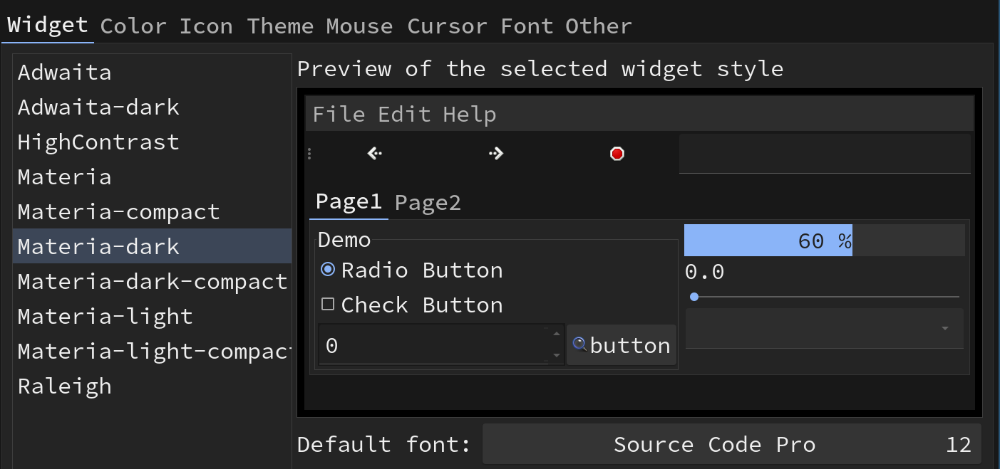

# Install GTK themes

After installing `X` implementation, it's optional to install different `GTK themes`.
Those themes can make the GUI application looks more nice.

**`GTK`** (The GIMP Toolkit) was initially made by the **`GNU`** Project for GIMP, 
but it is now a very popular toolkit with bindings for many languages.

- Install themes and configuration tools

    ```bash
    sudo pacman -Sy lxappearance materia-gtk-theme
    ```

    After installing, all the themes are located in `/usr/share/themes/`

</br>

- Run the configuration tool to pick the theme you like

    ```bash
    lxappearance
    ```

    

    The `Materia-dark` + `Source Code Pro` font would be a nice chocie.

    You can find more GTK themes at [here](https://wiki.archlinux.org/index.php/GTK).
