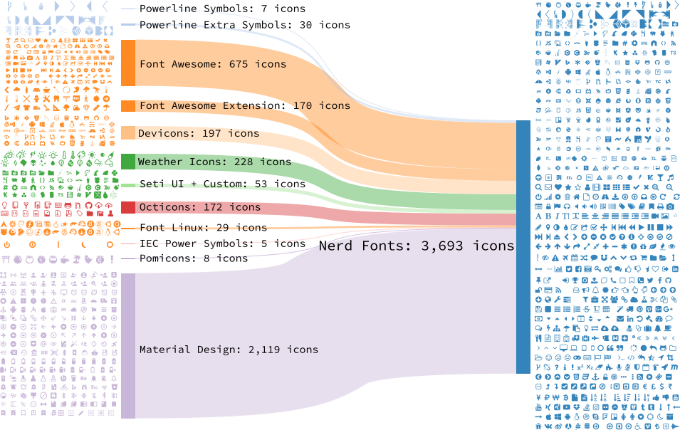
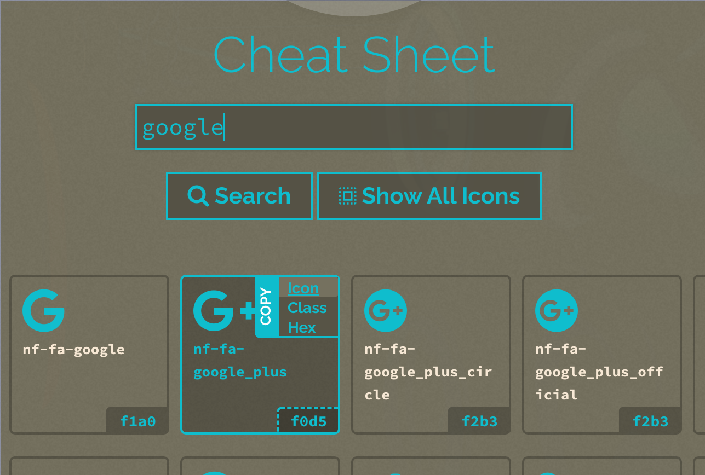

# Install **`NerdFont`**

**`Nerd Fonts`** is a project that patches developer targeted fonts with 
a high number of glyphs (icons). Basically, it adds all popular icons into
the popular fonts which call `patched font` which include the original font
and all supported icons. Then you can use any of those `patched font` to show
any supported icons below:

 

### Installation

```bash
doas apk --no-cache add font-source-code-pro-nerd
```

</br>

### Setup correct font name

As you can see that, the font name is **NOT** the **`Source Code Pro`**!!! So you
have to run the command below to know the **Real font name** which you can fill into
any application's font configuration file:

```bash
fc-list | grep Pro

# /usr/share/fonts/source-code-pro-nerd/Sauce Code Pro Bold Italic Nerd Font Complete.ttf: SauceCodePro Nerd Font:style=Bold Italic
# /usr/share/fonts/source-code-pro-nerd/Sauce Code Pro Light Nerd Font Complete.ttf: SauceCodePro Nerd Font:style=Light,Regular
# /usr/share/fonts/source-code-pro-nerd/Sauce Code Pro Black Italic Nerd Font Complete Mono.ttf: SauceCodePro Nerd Font Mono:style=Black Italic,Italic
# /usr/share/fonts/source-code-pro-nerd/Sauce Code Pro ExtraLight Nerd Font Complete Mono.ttf: SauceCodePro Nerd Font Mono:style=ExtraLight,Regular
# /usr/share/fonts/source-code-pro-nerd/Sauce Code Pro Light Italic Nerd Font Complete.ttf: SauceCodePro Nerd Font:style=Light Italic,Italic
# /usr/share/fonts/source-code-pro-nerd/Sauce Code Pro ExtraLight Italic Nerd Font Complete.ttf: SauceCodePro Nerd Font:style=ExtraLight Italic,Italic
# /usr/share/fonts/source-code-pro-nerd/Sauce Code Pro Medium Nerd Font Complete.ttf: SauceCodePro Nerd Font:style=Medium,Regular
# /usr/share/fonts/source-code-pro-nerd/Sauce Code Pro Medium Italic Nerd Font Complete.ttf: SauceCodePro Nerd Font:style=Medium Italic,Italic
# /usr/share/fonts/source-code-pro-nerd/Sauce Code Pro Light Italic Nerd Font Complete Mono.ttf: SauceCodePro Nerd Font Mono:style=Light Italic,Italic
# /usr/share/fonts/source-code-pro-nerd/Sauce Code Pro Light Nerd Font Complete Mono.ttf: SauceCodePro Nerd Font Mono:style=Light,Regular
# /usr/share/fonts/source-code-pro-nerd/Sauce Code Pro Semibold Italic Nerd Font Complete Mono.ttf: SauceCodePro Nerd Font Mono:style=Semibold Italic,Italic
# /usr/share/fonts/source-code-pro-nerd/Sauce Code Pro ExtraLight Italic Nerd Font Complete Mono.ttf: SauceCodePro Nerd Font Mono:style=ExtraLight Italic,Italic
# /usr/share/fonts/source-code-pro-nerd/Sauce Code Pro Bold Italic Nerd Font Complete Mono.ttf: SauceCodePro Nerd Font Mono:style=Bold Italic
# /usr/share/fonts/source-code-pro-nerd/Sauce Code Pro Black Nerd Font Complete.ttf: SauceCodePro Nerd Font:style=Black,Regular
# /usr/share/fonts/source-code-pro-nerd/Sauce Code Pro Semibold Italic Nerd Font Complete.ttf: SauceCodePro Nerd Font:style=Semibold Italic,Italic
# /usr/share/fonts/source-code-pro-nerd/Sauce Code Pro Medium Nerd Font Complete Mono.ttf: SauceCodePro Nerd Font Mono:style=Medium,Regular
# /usr/share/fonts/source-code-pro-nerd/Sauce Code Pro Black Nerd Font Complete Mono.ttf: SauceCodePro Nerd Font Mono:style=Black,Regular
# /usr/share/fonts/source-code-pro-nerd/Sauce Code Pro Nerd Font Complete Mono.ttf: SauceCodePro Nerd Font Mono:style=Regular
# /usr/share/fonts/source-code-pro-nerd/Sauce Code Pro Semibold Nerd Font Complete.ttf: SauceCodePro Nerd Font:style=Semibold,Regular
# /usr/share/fonts/source-code-pro-nerd/Sauce Code Pro Semibold Nerd Font Complete Mono.ttf: SauceCodePro Nerd Font Mono:style=Semibold,Regular
# /usr/share/fonts/source-code-pro-nerd/Sauce Code Pro Italic Nerd Font Complete Mono.ttf: SauceCodePro Nerd Font Mono:style=Italic
# /usr/share/fonts/source-code-pro-nerd/Sauce Code Pro Medium Italic Nerd Font Complete Mono.ttf: SauceCodePro Nerd Font Mono:style=Medium Italic,Italic
# /usr/share/fonts/source-code-pro-nerd/Sauce Code Pro ExtraLight Nerd Font Complete.ttf: SauceCodePro Nerd Font:style=ExtraLight,Regular
# /usr/share/fonts/source-code-pro-nerd/Sauce Code Pro Bold Nerd Font Complete.ttf: SauceCodePro Nerd Font:style=Bold
# /usr/share/fonts/source-code-pro-nerd/Sauce Code Pro Black Italic Nerd Font Complete.ttf: SauceCodePro Nerd Font:style=Black Italic,Italic
# /usr/share/fonts/source-code-pro-nerd/Sauce Code Pro Bold Nerd Font Complete Mono.ttf: SauceCodePro Nerd Font Mono:style=Bold
# /usr/share/fonts/source-code-pro-nerd/Sauce Code Pro Nerd Font Complete.ttf: SauceCodePro Nerd Font:style=Regular
# /usr/share/fonts/source-code-pro-nerd/Sauce Code Pro Italic Nerd Font Complete.ttf: SauceCodePro Nerd Font:style=Italic
```

Right now, you should notice that the font name is either **`SauceCodePro Nerd Font Mono`** or
**`SauceCodePro Nerd Font`**. So fill them into your application font configuration file.

For example, put it into the **`Alacritty` configuration file:

```bash
  # Bold italic font face
  bold_italic:
    # Font family
    #
    # If the bold italic family is not specified, it will fall back to the
    # value specified for the normal font.
    family: "SauceCodePro Nerd Font"

    # The `style` can be specified to pick a specific face.
    style: Bold Italic
```

</br>

### Copy icons from **`NerdFont`** cheatsheet

After setting the correct font name, then you can copy and paste the icons from the 
[**NerdFont cheatsheet**](https://www.nerdfonts.com/cheat-sheet) :


 

Just type any searching keyword there, place the mouse on top of the one you like, it will
show up a popup menu on the right-top corner. So, click `Icon` to copy to clipbobard,
then you can paste to anywhere to have that icon.

</br>

### `Vim` support

Add the settings below to your `vimrc` or `init.vim` (for **`neovim`**):

```bash
# 
Plug 'ryanoasis/vim-devicons'

# Set the `guifont` to your patched font name with the size
set guifont=SauceCodePro\ Nerd\ Font\ 11

# Enable this line if you use `vim-airline`
let g:airline_powerline_fonts = 1
```

Then run `:PlugInstall` and restart **`vim`** to take effect.

</br>


