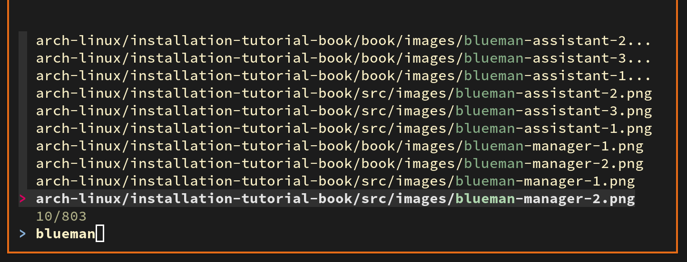
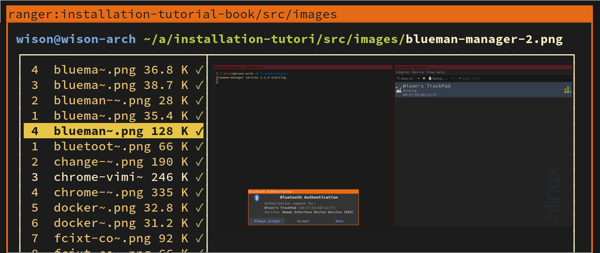
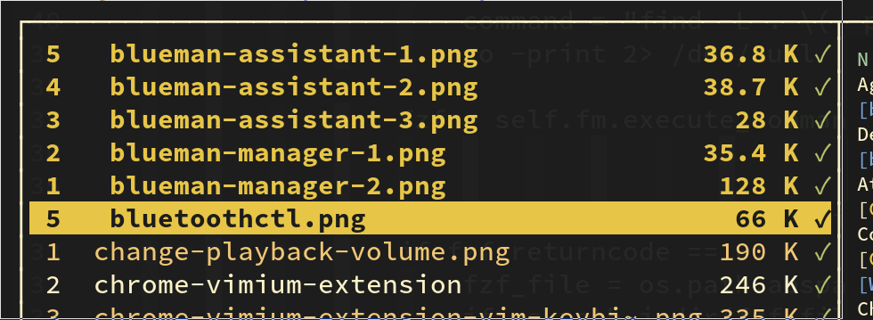
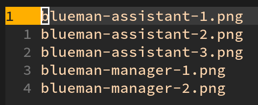

# Install Ranger

- Install

    ```bash
    sudo pacman -S ranger 
    
    # During the installation process, it will list another optional packages you might needed:

    # Optional dependencies for ranger
    #   atool: for previews of archives
    #   elinks: for previews of html pages
    #   ffmpegthumbnailer: for video previews
    #   highlight: for syntax highlighting of code
    #   libcaca: for ASCII-art image previews
    #   lynx: for previews of html pages
    #   mediainfo: for viewing information about media files
    #   odt2txt: for OpenDocument texts
    #   perl-image-exiftool: for viewing information about media files
    #   poppler: for pdf previews
    #   python-chardet: in case of encoding detection problems
    #   sudo: to use the "run as root"-feature
    #   transmission-cli: for viewing bittorrent information
    #   ueberzug: for previews of images
    #   w3m: for previews of images and html pages

    # You just pick what you want. For example:

    sudo pacman -S ueberzug highlight mediainfo sudo poppler
    ```

<br/>

- Generate your own configuration

    You need to run the command below to generate a copy of the `ranger` rc configuration, it will
    saved to your `~/.config/ranger/rc.conf`.

    ```bash
    ranger --copy-config=rc
    ```

<br/>

- The normal daily keybinding you need to know (just in case if you're new to `ranger`)

| Keybinding | Description
| ---------- | -------------------------------------------------------------------
| **`Basic`** | _Basic file and folder operations_
| yy         | Copy current file or folder, then you can to to any folder and paste it
| dd         | Cut current file or folder, then you can to to any folder and paste it
| dD         | Delete the file same with `rm -rf`, need to press `enter` to confirm
| pp         | paste the last copied file or folder to current folder
| yp         | (Yank full path), copy the full path with filename to clipboard
| yd         | (Yank dir), copy the full path WITHOUT filename to clipboard
| yn         | (Yank name), copy only the filename to clipboard
| cw         | (Change word), rename current file or folder
| I          | (Insert), rename, cursor position will be stopped at the beginning of the filename. </br> 
| a          | (append), rename, cursor position will be stopped at the end of the filename. </br> 
| A          | (append at the end), rename, cursor position will be stopped at the end of the extension name. </br> 
| cw         | (Change word), rename current file or folder
| oc         | Order/Sort by change time (latest to older)
| oC         | Order/Sort by change time (older to latest)
| ot         | Order/Sort by type
| oT         | Order/Sort by type (reversed)
| on         | Order/Sort by name
| oN         | Order/Sort by name (reversed)
| Control+h  | Toggle show hidden file
| :mkdir xx  | Create new folder
| :touch xx  | Create empty file
|            | 
| **`Select`** | _Select/Mark mode_
| va         | Select all or unselect all
| V          | Toggle select mode, move your cursor to select file in select mode
| Space      | Toggle select mode for single file
|            | 
| **`Change folder`** | _Change folder quickly_
| gh         | Go home (to `$HOME`)
| ge         | Go to `/etc`
| gu         | Go to `/usr`
| gv         | Go to `/var`
|            | 
| **`Shell`**| _Shell related operations_
| du         | Run `du`(disk usage) command on current foler and sort the result by size
| #          | Type your command to run in shell with current path, wait for press `enter` to return.
| Shift+s    | Open terminal with current folder/path. When you done, type `exit` to back to `ranger`.

<br/>

- Add customization configration if you needed

    Here are some very useful settings maybe can help you, `vim ~/.config/ranger/rc.conf` and pick
    what you want to try. You should search `set xxxx` and replace to the below settings.

    ```bash
    # Only show 2 columns with 1:2 width
    set column_ratios 2,4

    # Change color themes
    set colorscheme jungle

    # Show both borders, looks comfortable for some people
    # set draw_borders separators
    # set draw_borders outline
    # set draw_borders none
    set draw_borders both

    # Sync the folder name to window title
    set update_title true

    # Display `~` related to your home folder, save some display space
    set tilde_in_titlebar true

    # Show the relative line number. If you use this feature in `vim`, then
    # you will like it, it can help u fast jump to the specified line
    set line_numbers relative

    # Just add any `go to XXX` keybinding for yourself, For example:
    map gd cd ~/Downloads
    # map gr cd ~/Rust
    # map gs cd ~/Screenshots
    # map gb cd ~/my-shell/backup
    # map gp cd ~/xxx/yyy/zzz/...very deep path/YOUR_PROJECT_FOLDER

    # Replace the default `du` command, as it doesn't sort by size by default
    # map du shell -p du --max-depth=1 -h --apparent-size
    map du shell -p du --max-depth=1 -h --apparent-size | sort -rh
    ```

    </br>

    More powerful features:

    - Add `fuzzy finder` to `ranger`

        - First you need to install `fuzzy finder` by running `sudo pacman -S fzf`

        - Add `~/.config/ranger/commands.py` with the following settings

            ```bash
            from ranger.api.commands import Command
            
            class fzf_select(Command):
                """
                :fzf_select
            
                Find a file using fzf.
            
                With a prefix argument select only directories.
            
                See: https://github.com/junegunn/fzf
                """
                def execute(self):
                    import subprocess
                    import os.path
                    if self.quantifier:
                        # match only directories
                        command = "find -L . \( -path '*/\.*' -o -fstype 'dev' -o -fstype 'proc' \) -prune \
                        -o -type d -print 2> /dev/null | sed 1d | cut -b3- | fzf +m"
            
                    else:
                        # match files and directories
                        command = "find -L . \( -path '*/\.*' -o -fstype 'dev' -o -fstype 'proc' \) -prune \
                        -o -print 2> /dev/null | sed 1d | cut -b3- | fzf +m"
            
                    fzf = self.fm.execute_command(command,
                                                  universal_newlines=True,
                                                  stdout=subprocess.PIPE)
                    stdout, stderr = fzf.communicate()
                    if fzf.returncode == 0:
                        fzf_file = os.path.abspath(stdout.rstrip('\n'))
                        if os.path.isdir(fzf_file):
                            self.fm.cd(fzf_file)
                        else:
                            self.fm.select_file(fzf_file)
            ```

        - Add keybinding to `~/.config/ranger/rc.conf`

            ```bash
            map <c-f> fzf_select
            ```

        After that, open `ranger` and press `Control + f` and type any part of the file name,
        you got crazy fast search result:

        

        press `Enter` to go to the selected file:

        

    - Fast rename multiple selected files

        `vim ~/.config/ranger/rc.conf`, and then replace the below keybinding to overwrite the default one:

        ```bash
        map cw eval fm.execute_console("bulkrename") if fm.thisdir.marked_items else fm.open_console("rename ")
        ```

        After that, select all the files you want to rename to together like below:

        

        Then press `cw`, it will show your selected file name in your default editor. Change it and save it, done.

        
