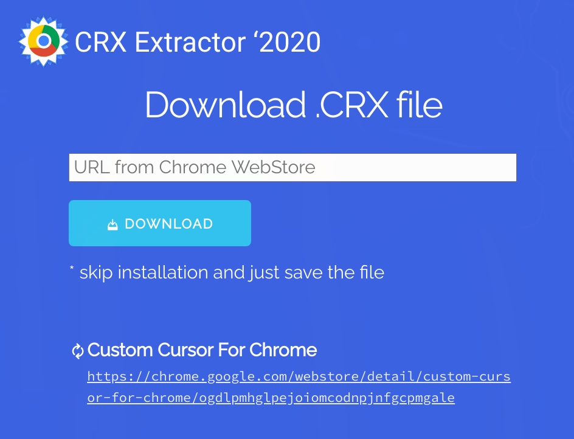
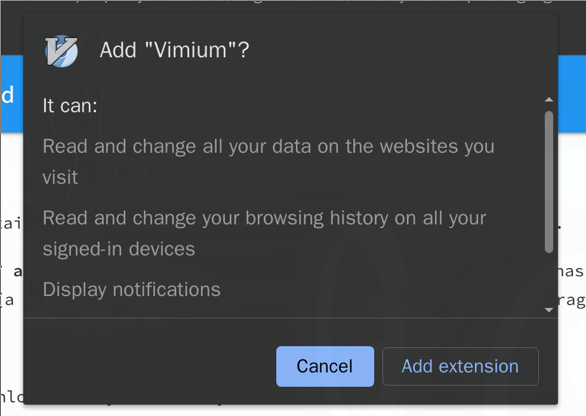

# Install ungoogled-chromium

If you like `Google Chrome` but don't like that it gathers your personal
information, then you can install `Ungoogled Chromium`!!!

</br>

- Install via `paru`
    ```bash
    paru -S ungoogled-chromium-appimage

    # If you don't want to compile from source code (around 4x,xxx source files)
    # which takes a few hours, then you can choose this package to install. 
    ```

    You can run the command below to see the install location:

    ```bash
    paru --query --list ungoogled-chromium-appimage

    # ungoogled-chromium-appimage /opt/
    # ungoogled-chromium-appimage /opt/appimages/
    # ungoogled-chromium-appimage /opt/appimages/ungoogled-chromium-87.0.4280.141.AppImage
    # ungoogled-chromium-appimage /opt/ungoogled-chromium/
    # ungoogled-chromium-appimage /opt/ungoogled-chromium/ungoogled-chromium-icon.png
    # ungoogled-chromium-appimage /usr/
    # ungoogled-chromium-appimage /usr/bin/
    # ungoogled-chromium-appimage /usr/bin/chromium
    # ungoogled-chromium-appimage /usr/bin/ungoogled-chromium
    # ungoogled-chromium-appimage /usr/share/
    # ungoogled-chromium-appimage /usr/share/applications/
    # ungoogled-chromium-appimage /usr/share/applications/chromium.desktop
    ```
</br>

- Apply the selected theme in `lxappearance`:

    - Open `chrome` with this url: `chrome://settings/?search=theme`
    - Then choose `Use GTK+`

    Also, you can open `chrome://settings/fonts?search=font` to change your
    customize fonts.

</br>

- Make it as the default browser

    The `xdg-settings set default-web-browser` seems doesn't work for `appimage`.
    You need to open `chrome://settings/defaultBrowser` and click the `Make default`
    button.

</br>

- Make sure you go through all questions here

    After opening the `ungoogled-chromium` for the first time, you better to go through
    [**Frequently Asked Questions**](https://ungoogled-software.github.io/ungoogled-chromium-wiki/faq#why-do-i-have-to-login-to-websites-every-time-i-open-ungoogled-chromium)

    Here is the brief version:

    - `chrome://settings/content/cookies`

        Uncheck `Clear cookies and site data when you quit Chromium`. Otherwise, you 
        have to login everytime for all websites.

        </br>

    - `chrome://settings/searchEngines`

        Go and pick the default search engine you like.

        </br>

    - How to install `Chrome extension`

        - Go to `chrome web store` and search for the extension you like to install, copy
        the URL. Take the [`vimium'](https://chrome.google.com/webstore/detail/vimium/dbepggeogbaibhgnhhndojpepiihcmeb) as an example:

        

        </br>

        - Go to [Get .CRX Chrome Extension](https://crxextractor.com/) and paste the `vimium`
        URL there, then click `DOWNLOAD` and click `GET .crx`, then it will download the `xxxx.crx`
        file for you.

            

            If you've already opened `chrome://flags/#extension-mime-request-handling` and changed the
            value from `Default` to `Always prompt for install`, then the install confirmation dialog 
            will pop-up. Otherwise, you need to install manually like below.

        </br>

        - You can drop that `crx` file to `chromium` to install or open it like below:
    
            ```bash
            ungoogled-chromium ./extension_1_66_0_0.crx
            ```

            


</br>

