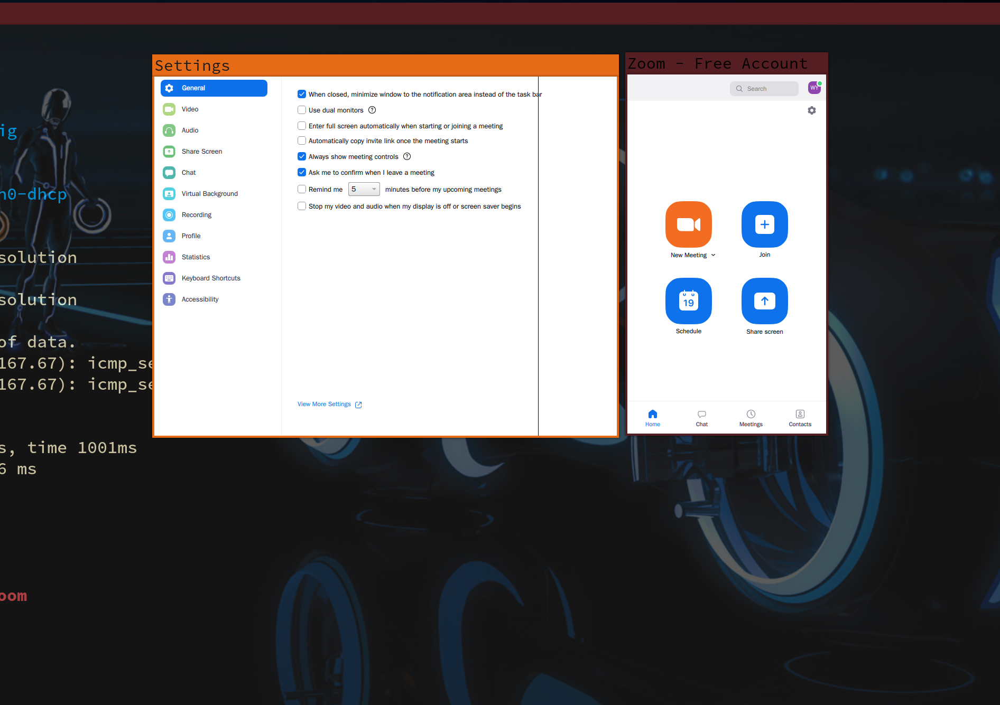

# Install zoom

- Install

    Download `zoom_x86_64.pkg.tar.xz` from [here](https://zoom.us/support/download)

    After that, install it by running:

    ```bash
    sudo pacman -U ./zoom_x86_64.pkg.tar.xz
    ```

</br>

- Fixed the UI font size

    Mayb you will see the UI has very tiny font size like this:

    

    If that happens, then add the `QT_SCALE_FACTOR` environment var to fix that.
    You can try `1` or `2` even `3` to have a look.

</br>

- Add hotkey to `i3`

    `vim ~/scripts/startzoom.sh` with the following settings:

    ```bash
    #!/bin/sh
    QT_SCALE_FACTOR=2 zoom &
    ```

    Change the `QT_SCALE_FACTOR` value to yours.

    Then add the following settings to `~/.config/i3/config`

    ```bash
    # Zoom
    bindsym $mod+z exec --no-startup-id ~/scripts/startzoom.sh
    ```
