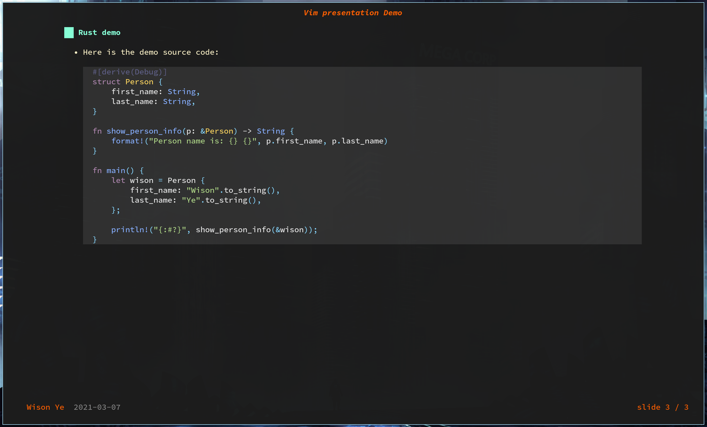
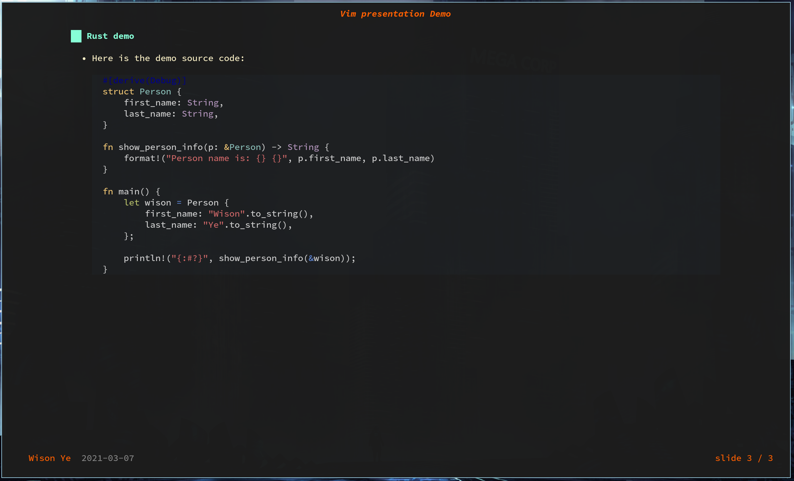

# lookatme

**Look At Me** is an interactive, extensible, terminal-based markdown presentation tool.

### Install

```bash
sudo pacman --sync --refresh python-pip
pip3 install lookatme
```

After that, you need to add the `~/.local/bin` to your shell `PATH`.

</br>

### How `lookatme` read the `.md` file

- Presentation meta data

    ```bash
    ---
    title: Vim presentation Demo
    author: Wison Ye
    date: 2021-03-07
    ---
    ```

    - `title`: The text show at top-center place.
    - `author`: The text show at left-bottom place.
    - `date`: The text show following by the `author`.

- `lookatme` use a `Smart sliding` feature:

    ```markdown
    # Different programming language quick demo
    // First slide content here

    ## TypeScript demo
    // Second slide content here

    ## Rust demo
    // Third slide content here

    // ...and so on
    ```

- Here is the demo md file as an example

    ```markdown
    ---
    title: Vim presentation Demo
    author: Wison Ye
    date: 2021-03-07
    ---
    
    # Different programming language quick demo
    
    Show different programming language in the same quick demo with the following overview:
    
    - Define a data structure type
    - Define a function
    - Call the function and print the result to console
    
    Below is the programming language we will have look today:
    
    - [TypeScript demo](typescript-demo)
    - [Rust demo](rust-demo)
    
    
    ## TypeScript demo
    
    - Here is the demo source code: 
    
        ```typescript
        interface Person {
            firstName: string
            lastName: string
            age?: number
        }
        
        const showPersonInfo = (p: Person) => {
            console.log(JSON.stringify(`Person name is: "${p.firstName} ${p.lastName}"`))
        }
        
        showPersonInfo({
            firstName: `Wison`,
            lastName: `Ye`
        })
        ```
    
    
    ## Rust demo
    
    - Here is the demo source code: 
    
        ```rust
        #[derive(Debug)]
        struct Person {
            first_name: String,
            last_name: String,
        }
    
        fn show_person_info(p: &Person) -> String {
            format!("Person name is: {} {}", p.first_name, p.last_name)
        }
    
        fn main() {
            let wison = Person {
                first_name: "Wison".to_string(),
                last_name: "Ye".to_string(),
            };
    
            println!("{:#?}", show_person_info(&wison));
        }
        ```
    ```

</br>

[Here](https://lookatme.readthedocs.io/en/latest/) is the latest documentation.

</br>

### How to run 

```bash
# Use `dark` theme and `material` style
lookatme --live-reload --theme dark --style material vim-presentation.md

# Use `dark` theme and `vim` style
lookatme --live-reload --theme dark --style vim vim-presentation.md
```

if `--live-reload` option is used, `lookatme` will watch the open file and reload all
the presentation in real-time.

When presentation is running, here is the way to do navigation:
- Next Slide: `l/j/right/space`
- Prev Slide: `h/k/left/delete/backspace`
- Quit: `q/Q`
- Vertically scroll within slide: `up/down` or `page up/page down`

</br>

### Some good looking `style` which match the `dark` theme

Use `dark` theme and `material` style:

`lookatme --live-reload --theme dark --style material vim-presentation.md`



</br>

Use `dark` theme and `vim` style:

`lookatme --live-reload --theme dark --style vim vim-presentation.md`



</br>

Another nice `dark` matching styles are:

- `native`
- `fruity` 
- `rrt`
- `paraiso-dark`
- `solarized-dark`
- `stata-dark`
- `inkpot`
- `zenburn`

</br>

