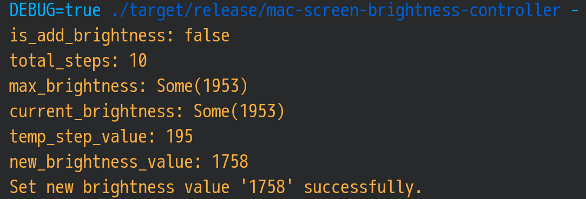

# Screen brightness control

### The basic approach to control screen brightness

```bash
# Print out the current screen brightness
cat /sys/class/backlight/intel_backlight/brightness

# Print out the maximum screen brightness
cat /sys/class/backlight/intel_backlight/max_brightness

# Set the current screen brightness
sudo bash -c "echo 512 > /sys/class/backlight/intel_backlight/brightness"
```

### For the `iMac`

Sometimes `acpi` doesn't work very well on `iMac`, for the case I met, the `iMar 5K`
screen is very bright by default and can't control via the `/sys/class/backlight` 
file system path.

Even you can't control the brightness, but it's reduce the default brightness
(at least not 100% brightness). For that purpose, you can disable the `acpi` 
brightness control for the `iMac` via the steps below:

-  `sudo vim /etc/default/grub` and add the `acpi_backlight=none` settings like below:

    ```bash
    # Assume `loglevel=3 quiet` is your original settings
    GRUB_CMDLINE_LINUX_DEFAULT="loglevel=3 quiet acpi_backlight=none"
    ```

- Then re-generate the `GRUB` based on your new settings

    ```bash
    sudo grub-mkconfig -o /boot/grub/grub.cfg
    ```

</br>

### Build the `mac-light-controller` (it only work for `MacBookPro`)

- Pull from repo, build it

    ```bash
    # Go into any folder you want
    git clone https://github.com/wisonye/mac-light-controller.git
    cd mac-light-controller
    cargo clean && \
    cargo build --release && \
    strip ./target/release/mac-light-controller 

    # Move to any folder you want `i3` to launch from there (Optional)
    mv ./target/release/mac-light-controller ~/scripts/
    ```

</br>

- Add keybinds to `i3` configuration file

    `vim ~/.config/i3/config` and add the following settings:

    ```bash
    # ===========================================================================
    # Screen brightness control
    # ===========================================================================
    bindsym XF86MonBrightnessUp exec --no-startup-id ~/scripts/mac-light-controller Screen +
    bindsym XF86MonBrightnessDown exec --no-startup-id ~/scripts/mac-light-controller Screen -
    bindsym XF86KbdBrightnessUp exec --no-startup-id ~/scripts/mac-light-controller Keyboard +
    bindsym XF86KbdBrightnessDown exec --no-startup-id ~/scripts/mac-light-controller Keyboard -
    ```

</br>

- Allow any linux account in `wheel` group can modify the backlight system file with `root` permission

    - `sudo vim /etc/udev/rules.d/90-backlight.rules` and add the following settings:

        ```bash
        SUBSYSTEM=="backlight", ACTION=="add", \
            RUN+="/bin/chgrp wheel /sys/class/backlight/%k/brightness", \
            RUN+="/bin/chmod g+w /sys/class/backlight/%k/brightness"
        ```

    - `sudo vim /etc/udev/rules.d/91-leds.rules` and add the following settings:

        ```bash
        SUBSYSTEM=="leds", ACTION=="add", \
            RUN+="/bin/chgrp wheel /sys/class/leds/%k/brightness", \
            RUN+="/bin/chmod g+w /sys/class/leds/%k/brightness"
        ```

    Of course, make sure your current linux account is in `wheel` group!!!

    Reload `i3`, then press the screen brightness control key, it should work.
    You can run the script manually like below to test it if it doesn't work.

    
