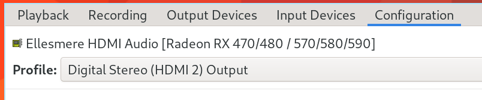
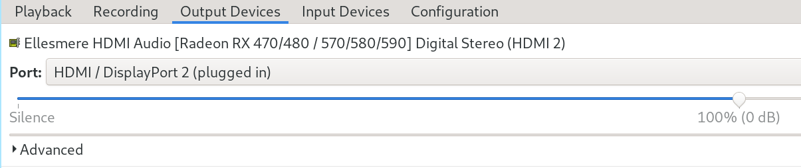

# Multiple monitor

## Understand the `xrandr` output

`Xrandr` is used to set the size, orientation and/or reflection of the outputs
for a screen. Here is sample output when running `xrandr` without any params:

```bash
xrandr

# eDP connected primary 3840x2160+0+0 (normal left inverted right x axis y axis) 597mm x 336mm
#    3840x2160     60.00*+
#    3200x1800     59.98  
#    2560x1440     59.95  
#    1920x1200     60.00  
#    1920x1080     60.00  
#    1600x1200     60.00  
#    1680x1050     60.00  
#    1280x1024     60.00  
#    1440x900      60.00  
#    1280x800      60.00  
#    1280x720      60.00  
#    1024x768      60.00  
#    800x600       60.00  
#    640x480       60.00  
# DisplayPort-0 disconnected (normal left inverted right x axis y axis)
# DisplayPort-1 connected (normal left inverted right x axis y axis)
#
#  3840x2160     60.00 +  30.00
#  2560x1440     59.95
#  1920x1200     60.00
#  1920x1080     60.00    59.94
#  1600x1200     60.00
#  1680x1050     60.00
#  1600x900      60.00
#  1280x1024     60.02
#  1440x900      60.00
#  1280x800      59.81
#  1280x720      60.00    59.94
#  1024x768      60.00
#  800x600       60.32
#  720x480       60.00    59.94
#  640x480       60.00    59.94
```

As you can see above:

- `eDP` usually is the built-in monitor.

- `XXXXX connected` is the external monitor you're connecting to.

- For each monitor, it follows all supported resolutions and refresh rates from
high to low. So the first line always be the best settings.


</br>


## You got 2 ways to use the external monitor:

#### 1. Mirror

`--auto` means:

- For  connected  but disabled outputs, this will enable them using their first preferred mode (or, something close to 96dpi if they have no preferred mode). 

- For disconnected but enabled outputs, this will disable them.


```bash
xrandr \
    --output "eDP" --auto \
    --output "DisplayPort-1" --auto

# `--same-as` means use the same settings with the particular monitor,
# but it will error is the monitor already turned off
xrandr \
    --output "eDP" --auto \
    --output "DisplayPort-1" --same-as "eDP"
```

</br>

Or you can use the special settings like below:

```bash
xrandr \
    --output "eDP" --auto \
    --output "DisplayPort-1" --mode 3840x2160
```

</br>

#### 2. Extension

You can specific the external monitor's position by using one of the settings
below:

- `--left-of`
- `--right-of`
- `--above`
- `--below`

</br>

```bash
xrandr \
    --output "eDP" --auto \
    --output "DisplayPort-1" --auto --right-of "eDP"
```

</br>


#### 3. Handy scripts

- Create `~/scripts/monitors.sh` with the following content:

    ```bash
    #!/usr/bin/fish

    set action $argv
    set builtin "eDP"
    set external "DisplayPort-1"


    switch $action
        case "turnoff"
            xrandr \
                --output "$builtin" --auto \
                --output "$external" --off
            printf "Turn off external monitor.\n\n"

        case "mirror"
            xrandr \
                --output "$builtin" --auto \
                --output "$external" --auto --same-as "$builtin"

            printf "Toggle external monitor to on the right side in mirror mode.\n\n"

        case "extra"
            xrandr \
                --output "$builtin" --auto \
                --output "$external" --auto --left-of "$builtin"
            printf "Toggle external monitor to on the right side in extra.\n\n"

        case "extra-rotate"
            xrandr \
                --output "$builtin" --auto \
                --output "$external" --auto --right-of "$builtin" --rotate left
            printf "Toggle external monitor to on the right side in extra vertical.\n\n"

        case "*"
            printf "Doesn't support the action: $action\n\n"
    end
    ```

    </br>


- Use `dmenu + xargs` to show a prompt to select the parameters to run the
`monitors.sh`.

    Create the `~/scripts/control-monitor.sh` the following content:

    ```bash
    #!/bin/sh
    echo -e "turnoff\nextra\nextra-rotate\nmirror" | \
    dmenu -i -p "Pick the monitor action: " | \
    xargs -I % monitors.sh "%"
    ```

</br>


#### 4. Audio via **USB-C** or **HDMI**

If the external monitor supports audio output, then you need to make sure switch
to the `HDMI` audio output in the `pavucontrol` like below:





</br>

