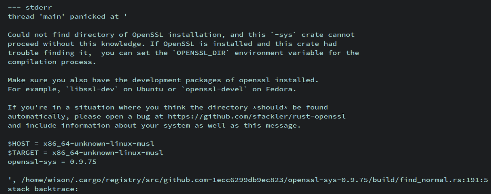

# OpenSSL Dev

- Rust crate (`openssl` or `openssl-sys`) build fail

    Sometimes, you will see tne following error when compiling any rust crate that
    rely on `openssl-sys` crate:

    

    </br>


    Easy to solve, install the dev package:

    ```bash
    doas apk --no-cache add openssl-dev
    ```

    </br>

- How to fix `static linked` becomes `dynamically linked`


    `openssl` becomes `dynamically linked` even though it's supposed to be
    `static linked` in Alpine Linux.

    Here is the binary dynamic link case by running `cargo build` in Alpine Linux:

    ```bash
    file  target/x86_64-unknown-linux-musl/debug/auction-core-service

    # target/x86_64-unknown-linux-musl/debug/auction-core-service: ELF 64-bit LSB pie executable, x86-64, version 1 (SYSV), dynamically linked, with debug_info, not stripped
    ```
    which should be `static-pie linked`!!!

    </br>

    ```bash
    ldd  target/x86_64-unknown-linux-musl/debug/auction-core-service

    #         /lib/ld-musl-x86_64.so.1 (0x7fb96554b000)
    #         libssl.so.3 => /lib/libssl.so.3 (0x7fb9643eb000)
    #         libcrypto.so.3 => /lib/libcrypto.so.3 (0x7fb964034000)
    #         libc.musl-x86_64.so.1 => /lib/ld-musl-x86_64.so.1 (0x7fb96554b000)
    ```

    which should be relied on only `/lib/ld-musl-x86_64.so.1 (0x7fb96554b000)`!!!

    </br>

    So, when you run the binary, it will fail with `Segmentation fault`!!!

    </br>


    How to fix it???

    - Find the `openssl-dev` lib folder and include folder:

        ```bash
        apk info --content openssl-dev

        # openssl-dev-3.0.7-r0 contains:
        # usr/include/openssl/aes.h
        # ......
        # usr/include/openssl/x509v3err.h
        # usr/lib/libcrypto.so
        # usr/lib/libssl.so
        ```

        That means `/usr/include/openssl` and `/usr/lib` is the folder you're
        looking for.

        </br>

    - Add the follow env vars to override `pkg_config` preset values to run `cargo`

        ```bash
        OPENSSL_STATIC=1 \
        OPENSSL_LIB_DIR=/usr/lib \
        OPENSSL_INCLUDE_DIR=/usr/include/openssl \
        cargo build
        ```

        _`OPENSSL_STATIC` setting only works when both `OPENSSL_LIB_DIR` and
        `OPENSSL_INCLUDE_DIR` exists at the same time!!!_

        </br>


        After that, you will see the binary is `static linked`:


        ```bash
        file target/debug/auction-core-service
        # target/debug/auction-core-service: ELF 64-bit LSB pie executable, x86-64, version 1 (SYSV), static-pie linked, with debug_info, not stripped
        ```

        </br>

        ```bash
        ldd target/debug/auction-core-service
        #        /lib/ld-musl-x86_64.so.1 (0x7f812f637000)
        ```

        </br>


