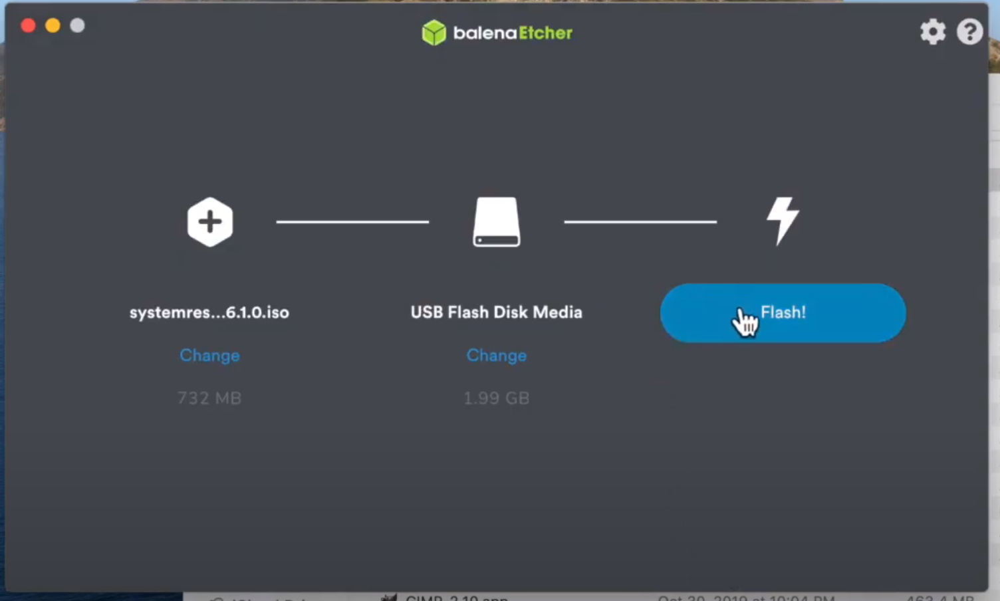

# Prepare your live ISO USB

Go to [here](https://alpinelinux.org/downloads/) and pick your closest mirror to download the ISO, then burn into a USB.
Plug your USB into computer and boot the live ISO, it will automatic login to install Arch, then follow the steps below to 
install your own `Arch Linux`.

After that, reboot into your live ISO USB to continue the installation.
