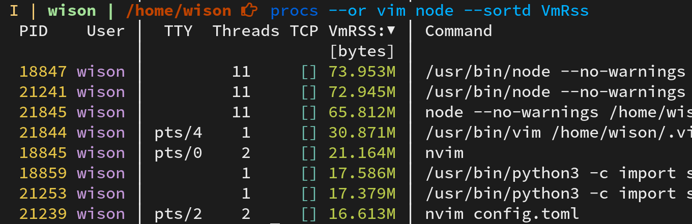

# Recommended package to install

All the packages below are optional but recommended which can make your life a bit easier before you install any DE (**`Desktop Environment`**) or WM (**`Window Manager`**).

- Useful utils

    ```bash
    doas apk --no-cache add ripgrep bat openssh bash neofetch util-linux lf
    ```

    `util-linux` package provides somthing like `lscpu, lsblk`, etc

    </br>

    If you use `bat` to print content, it can't display correctly, then try this
    to fix that:

    ```bash
    doas vi /etc/rc.conf

    # Change unicode value to `YES`
    unicode="YES"
    ```

    Reboot to take effect.

    </br>

- `lfs` is a better option of `du`, written in `Rust`.

    ```bash
    doas apk --no-cache lfs
    ```

    </br>

- `fzf` is a CLI fuzzy finder, the `hc` fish abbr based on it!!!

    ```bash
    doas apk --no-cache fzf fzf-doc
    ```

    </br>

- `tealdeer` is a very fast implementation of tldr in Rust.

    ```bash
    cargo install tealdeer

    # You have to run this before you can query any command help!!!
    tealdear --update
    ```

    </br>

    Sample usage:

    ```bash

    tldr iptables

    # Program that allows configuration of tables, chains and rules provided by the Linux kernel firewall.
    # More information: <https://www.netfilter.org/projects/iptables/>.

    # View chains, rules, and packet/byte counters for the filter table:

    #     sudo iptables -vnL

    # Set chain policy rule:

    #     sudo iptables -P chain rule

    # Append rule to chain policy for IP:

    #     sudo iptables -A chain -s ip -j rule

    # Append rule to chain policy for IP considering protocol and port:

    #     sudo iptables -A chain -s ip -p protocol --dport port -j rule

    # Add a NAT rule to translate all traffic from the `192.168.0.0/24` subnet to the host's public IP:

    #     sudo iptables -t nat -A POSTROUTING -s 192.168.0.0/24 -j MASQUERADE

    # Delete chain rule:

    #     sudo iptables -D chain rule_line_number

    # Save iptables configuration of a given table to a file:

    #     sudo iptables-save -t tablename > path/to/iptables_file

    # Restore iptables configuration from a file:

    #     sudo iptables-restore < path/to/iptables_file
    ```

    </br>

- `tokei` used to count code very quick, written in Rust.

    ```bash
    doas apk --no-cache tokei
    ```

    </br>

    Sample usage:

    ```bash
    tokei --sort lines

    # ===============================================================================
    # Language            Files        Lines         Code     Comments       Blanks
    # ===============================================================================
    # TOML                    4          432          284           90           58
    # Plain Text              1           92            0           80           12
    # Dockerfile              1           57           15           33            9
    # JSON                    1           23           23            0            0
    # -------------------------------------------------------------------------------
    # Rust                   16         1279         1021          119          139
    # |- Markdown            13           78            0           72            6
    # (Total)                           1357         1021          191          145
    # -------------------------------------------------------------------------------
    # Markdown                1          497            0          296          201
    # |- BASH                 1          294          110          154           30
    # (Total)                            791          110          450          231
    # ===============================================================================
    # Total                  24         2380         1343          618          419
    # ===============================================================================
    ```

    </br>

- `procs` is a replacement for `ps` written in `Rust`.

    ```bash
    doas apk --no-cache procs
    ```

    Optionally, you can add `alias ps="procs"` (for `bash`) or `abbr ps "pros"` (for `fish`)
    to your shell configuration file.

    Some use cases:

    ```bash
    # Query `vim` related process
    procs vim

    # Query `vim` or `alacritty` related process
    procs --or vim alacritty

    # Query `vim` or `alacritty` and ascending sort by PID
    procs --or --sorta PID vim alacritty

    # Query `vim` or `alacritty` and descending sort by memory
    procs --or --sortd VmRss vim alacritty

    # Query `vim` or `alacritty` related process in watch mode (1s refresh rate)
    procs --or --watch vim alacritty
    ```

    </br>

    Also, you can custom the config to control which informat you want to show:

    `vim ~/.config/procs/config.toml` with the following settings:

    ```bash
    # For more detail setting information, plz visit https://github.com/dalance/procs
    
    [[columns]]
    # The column kind to show
    kind = "Pid"
    # Use which color to show
    style = "BrightYellow|Yellow"
    # This column can be search for as numeric parameter passed
    # to `procs` command?
    numeric_search = true
    # This column can be search for as non-numeric parameter passed
    # to `procs` command?
    nonnumeric_search = false
    # Alignment, "Left, Center, Right". "Left" by default.j
    # align = "Right"
    
    [[columns]]
    kind = "User"
    style = "BrightMagenta|Magenta"
    numeric_search = false
    nonnumeric_search = true
    align = "Right"
    
    [[columns]]
    kind = "Separator"
    style = "BrightWhite|White"
    color_075 = "BrightWhitee"
    numeric_search = false
    nonnumeric_search = false
    align = "Center"
    
    [[columns]]
    kind = "Tty"
    style = "BrightWhite|White"
    numeric_search = false
    nonnumeric_search = false
    align = "Center"
    
    [[columns]]
    kind = "Threads"
    style = "BrightWhite|White"
    numeric_search = false
    nonnumeric_search = false
    align = "Center"
    
    [[columns]]
    kind = "TcpPort"
    style = "BrightCyan|Cyan"
    numeric_search = true
    nonnumeric_search = false
    align = "Right"
    
    [[columns]]
    kind = "VmRss"
    style = "BrightGreen|Green"
    numeric_search = false
    nonnumeric_search = false
    align = "Right"
    
    # [[columns]]
    # kind = "UsageCpu"
    # style = "BrightGreen|Green"
    # numeric_search = false
    # nonnumeric_search = false
    # align = "Center"
    # 
    # [[columns]]
    # kind = "UsageMem"
    # style = "BrightGreen|Green"
    # numeric_search = false
    # nonnumeric_search = false
    # align = "Center"
    
    [[columns]]
    kind = "Separator"
    style = "BrightWhite|White"
    numeric_search = false
    nonnumeric_search = false
    align = "Center"
    
    [[columns]]
    kind = "Command"
    style = "BrightWhite|White"
    numeric_search = false
    nonnumeric_search = true
    align = "Left"
    
    [search]
    numeric_search = "Exact"
    nonnumeric_search = "Partial"
    logic = "And"
    
    [display]
    show_self = false
    show_thread = false
    show_thread_in_tree = true
    cut_to_terminal = true
    cut_to_pager = false
    cut_to_pipe = false
    color_mode = "Always"
    
    [sort]
    column = 0
    order = "Ascending"
    # order = "Descending"
    
    [docker]
    path = "unix:///var/run/docker.sock"
    
    [pager]
    mode = "Auto"
    ```

    The custom config above show with the follow colums:

    `PID, User, TTY, Threads, TCP, VmRSS, Command`

    Here is the running example:

    - Search by TCP port:

        

    - `Or` search by name and sort (desc) by memory usage:

         <++>
    </br>

