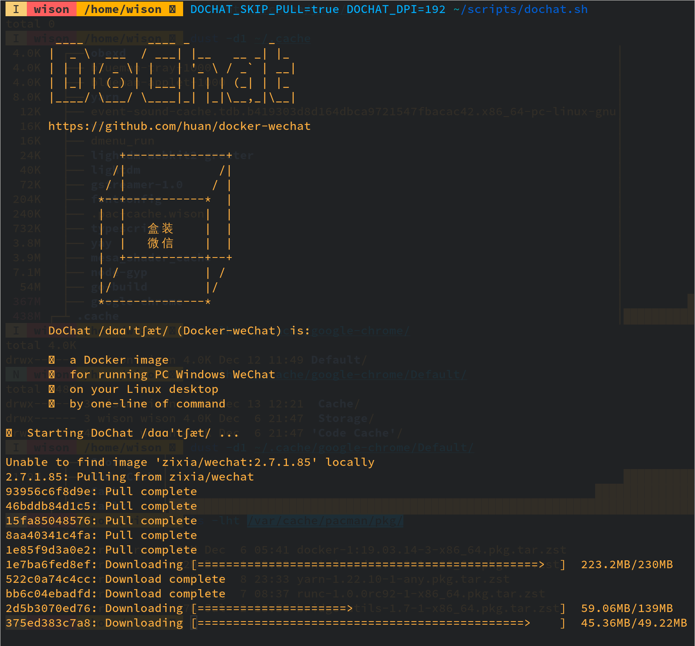

# Running wechat in docker

- Install

    ```bash
    # Download the docker run script
    curl "https://raw.githubusercontent.com/huan/docker-wechat/master/dochat.sh" --output ~/scripts/dochat.sh

    # Make it executable
    chmod +x ~/scripts/dochat.sh
    ```

</br>

- Better to make an `alias` or `abbreviation` in your shell 

    For example in `fish` shell

    ```bash

    # "DOCHAT_DEBUG=true": print out the debug info which can help if start fail.
    #
    # "DOCHAT_DPI=192": for the display scale. Allows value below:
    #       96  100%
    #       120 125%
    #       144 150%
    #       192 200%
    #
    # "DOCHAT_SKIP_PULL=true": Don't pull latest docker image every time.
    #
    # For more detail informations, access here: https://github.com/huan/docker-wechat
    #
    abbr startwebchat "DOCHAT_DEBUG=true DOCHAT_SKIP_PULL=true DOCHAT_DPI=192 ~/scripts/dochat.sh"
    ```

</br>

- Run it

    ```bash
    # Make sure to run this command once to allow all users can access your X
    xhost +

    startwebchat
    ````

</br>

When you run it at the first time, it will pull the image then run it.




After that, it should run:


