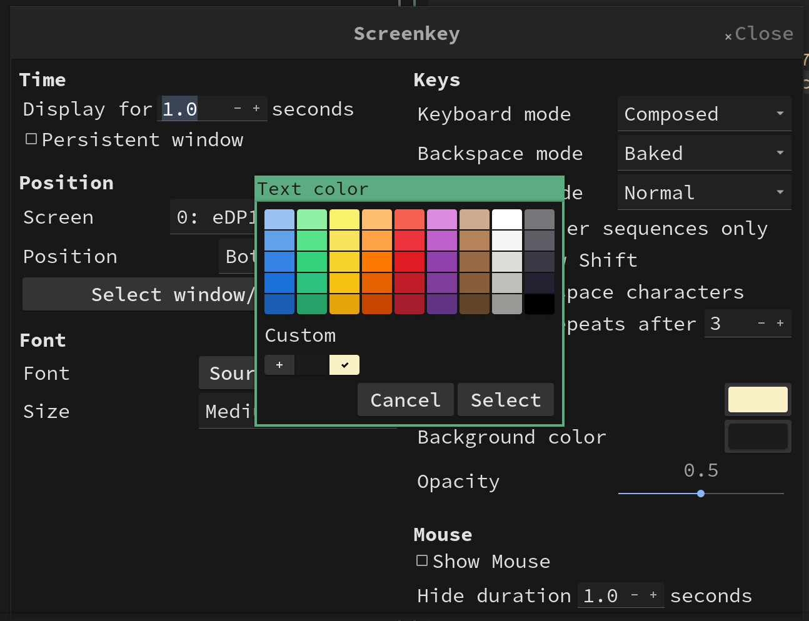
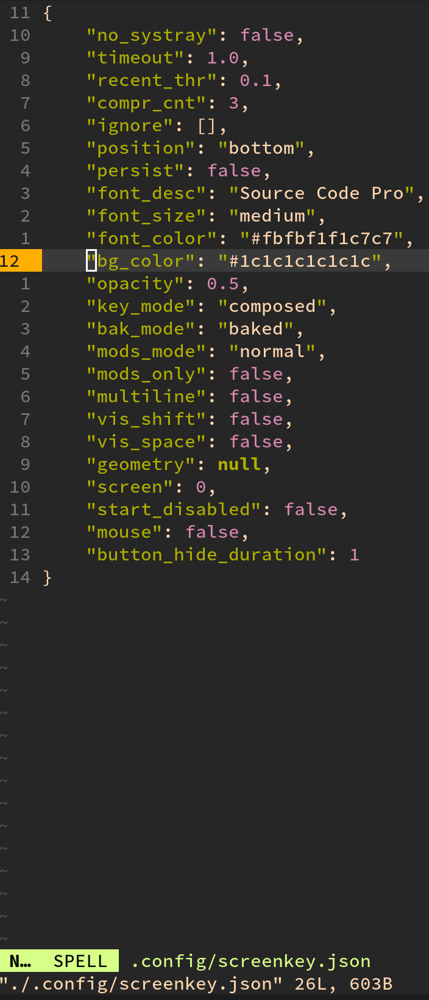

# Screen recording

- `screenkey`

    - Install

        ```bash
        sudo pacman -S screenkey
        ```
    </br>

    - Configuration

        When you run `screenkey`, the last config will be saved to `~/.config/screenkey.json`.

        But DO NOT edit this file manually, you should use the startup parameters or the `peference`
        menu in the tray icon to do that.

        

        If you don't pass the `--no-systray`, then the tray icon will be shown.

    </br>

    - About the `color` settings

        

        As you can see above, the `R,G, B` value will be `double`!!! If you don't double, then `screenkey`
        won't run!!!

    </br>

    -   `i3` keybinding for toggling `screenkey`

        `vim ~/scripts/toggle-screenkey.sh` with the following content:

        ```bash
        #!/bin/bash
        
        KILL_RESULT=$(killall -v screenkey 2>&1)
        PROCESS_NOT_FOUND_STR="no process found"
        echo "KILL_RESULT: $KILL_RESULT"
        
        if [[ $KILL_RESULT == *"$PROCESS_NOT_FOUND_STR"* ]]; then
            echo "'screenkey' started."
            screenkey --no-systray --timeout 1 \
                    --opacity 0.5 \
                    --no-whitespace \
                    --font "So urce Code Pro" \
                    --font-size medium \
                    --font-color "#FBFBF1F1C7C7" \
                    --bg-color "#1C1C1C1C1C1C" &
        else
            echo "Killed all 'screenkey'"
        fi
        ```

        `vim ~/.config/i3/config` and add the following settings:

        ```bash
        # Toggle `screenkey`
        bindsym $mod+s exec --no-startup-id ~/scripts/toggle-screenkey.sh
        ```

</br>

- Simple screen recorder

    ```bash
    sudo pacman -S simplescreenrecorder
    ```
