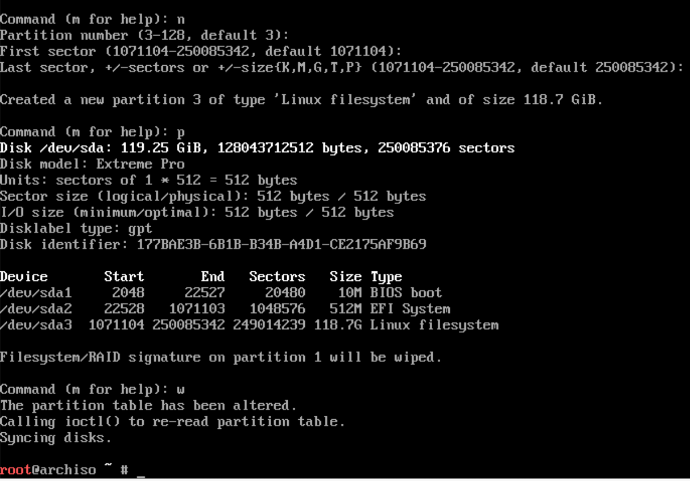

# Setup partitions on USB

If you want to install the entire `Arch Linux` on a portable USB driver, please keep reading.

- List your installation target disk by running `fdisk -l`. The following example supposes that your disk is `/dev/sdX`, change the `X` to your own one!!!

</br>

- To confirm your `boot mode`:

    ```bash
    ls /sys/firmware/efi/efivars
    ```

    If the command shows the directory without error, then the system is booted in **`UEFI`** mode.
    If the directory does not exist, the system may be booted in `BIOS` (or `CSM`) mode.

</br>

- Detail about **`BIOS`** and **`UEFI`**

    Basically, there are two different systems implemented today that motherboards use to communicate 
    between an operating system and their firmware. There is the standard (legacy) **`BIOS`** (basic input/output system), 
    and there is the newer **`UEFI`** (unified extensible firmware interface). Although **`UEFI`** was implemented on some top-end machines in the early 2000s, any computer more than six or seven years old is probably only going to be able to boot up in **`BIOS`** mode. Newer machines, on the other hand, will often be capable of booting in both **`UEFI`** mode and **`BIOS`** mode. Many times a preferred boot mode can be selected from the BIOS menu on such machines. Current Apple computers only recognize **`UEFI`**.

    Both **`BIOS`** and **`UEFI`** require different particular partition schemes in order to boot. 
    If the motherboard is set to boot in **`UEFI`** mode only and the inserted boot media does not have the correct partition scheme for **`UEFI`**, the boot will fail; the same goes for an attempted **`BIOS`** boot. This is one place I believe some of the USB installation guides out there fail: they often only describe how to create a USB boot device that uses only one mode. It is possible, however, to setup a USB drive that will have a partition scheme allowing it to boot in both modes and still use the same persistent installation of Linux. This guide will setup such a scheme in the partitioning and formatting sections below.

    On most newer machines, you will be presented with the option to boot in either **`BIOS`** or **`UEFI`** mode from your bootable USB. This means the machine recognizes the **`UEFI`** boot media, but it does not always mean the machine is actually set to boot in **`UEFI`** mode, and selecting the **`UEFI`** boot option may fail. Selecting a mode that the motherboard is not set to boot in will not damage anything or touch any of the other drives on the machine, the boot will simply fail and one can reboot in the other mode. The USB stick created with this guide has been able to boot on every (about a dozen) desktop and laptop, new and old, **`BIOS`** and **`UEFI`**, machine that I have tried it on.

</br>

- Follow the steps below to setup your Arch Linux partition:

    We will setup a USB which compitlabe with both **`BIOS`** and ****`UEFI`****!!!

    - Run `fdisk /dev/sdX`

    - Delete all existing partitions

        ```bash
        # First, make sure you use `d` to delete all existing partitions!!!
        # First, make sure you use `d` to delete all existing partitions!!!
        # First, make sure you use `d` to delete all existing partitions!!!
        `d` // Untill all partitions are be deleted!
        ```

    - Create new partition table

        ```bash
        # As I confirmed my boot mode is **`UEFI`**, then I should use `GPT` partition.
        # Press `g` to create a new empty `GPT` partition table, it will remove all 
        # your exists partitions.
        # After pressing `g`, you should be able to see something like below:
        #
        # "Created a new GPT dislabel (GUID: xxxxxxxxx)."
        `g`
        ```

        

    - Create `10MB` **MBR** partition

        ```bash
        `n`
        `1` or just `Enter` to use partition no `1`
        `Enter` to use the default start sector
        `+10M` to set this partition size to `10M`
        #
        # If success, you should see `Created a new partition 1 of type 
        # `Linux filesystem` and of size 10 MiB.

        # If it asks you "Partition #X contains a YYYY signature, Do you want to
        # remove the signature", then press 'Y' to remove the previous partition
        # signature.
        #
        # We need to change the partition type from `Linux filesystem` to `BIOS BOOT`. 
        # Before that you can press `l` to list all supported partition types:
        `t`
        `4`, 

        # Finally, press `p` to confirm the result, it should look like this
        #
        # /dev/sdX1   (ignore the sector numbers there) 10M BIOS boot
        ```

        

    - Create `512MB` ESP (EFI System Partition) which will be mounted to `/boot` and hold the bootloader

        ```bash
        `n`
        `2` or just `Enter` to use partition no `2`
        `Enter` to use the default start sector
        `+512M` to set this partition size to `512MB`
        # 
        # If success, you should see `Created a new partition 2 of type 
        # `Linux filesystem` and of size 512 MiB.

        # We need to change the partition type from `Linux filesystem` to 
        # `EFI System`. Before that you can press `l` to list all supported
        # partition types:
        `t`
        `2` to make sure select the 512MB partition
        `1` which means `EFI System`

        # Finally, press `p` to confirm the result, it should look like this
        #
        # /dev/sdX1   (ignore the sector numbers there) 10M  BIOS boot
        # /dev/sdX2   (ignore the sector numbers there) 512M EFI System
        ```

        

    - Finally, create the linux root partition which will be mounted to `/` and hold the entire Linux system

        ```bash
        `n`
        `3` or just `Enter` to use partition no `3`
        `Enter` to use the default start sector
        `Enter` to use all the left spaces
        # If success, you should see `Created a new partition 3 of type 
        # `Linux filesystem` and of size XXXX GiB.

        # Finally, press `p` to confirm the result, it should look like this
        #
        # /dev/sdX1   (ignore the sector numbers there) 10M  BIOS boot
        # /dev/sdX2   (ignore the sector numbers there) 512M EFI System
        # /dev/sdX3   (ignore the sector numbers there) XXXG Linux filesystem
        ```

        

    - The last step is press `w` to write all changes into the disk!!!
        ```bash
        `w`
        ```


