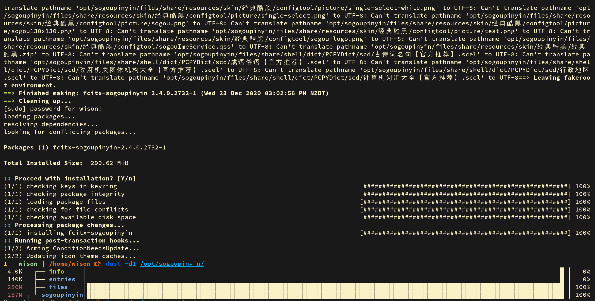
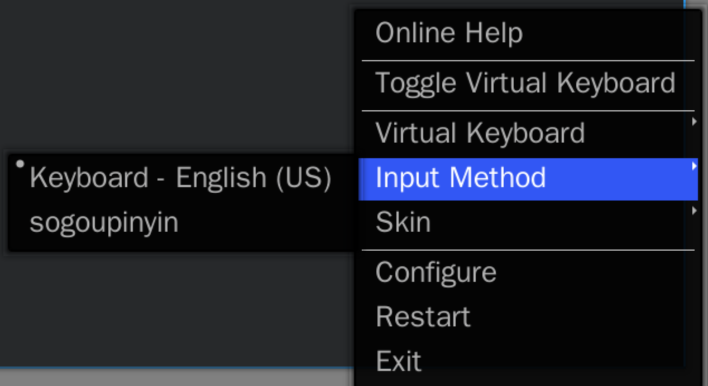
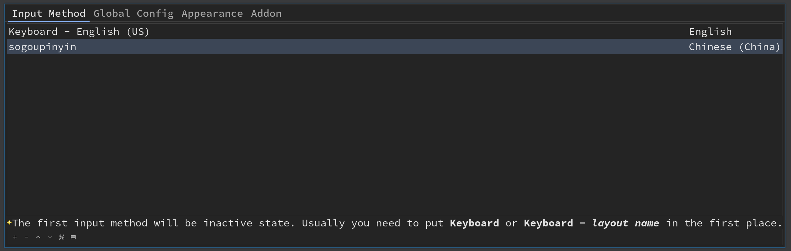
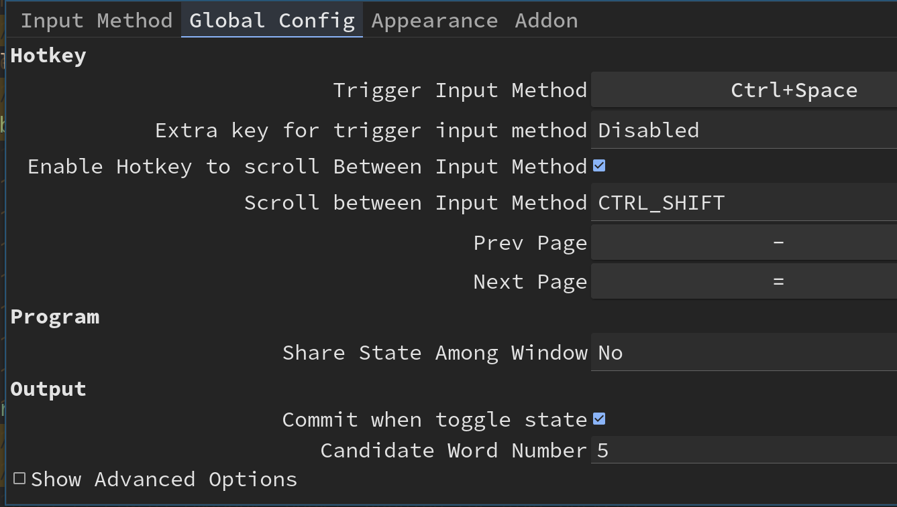
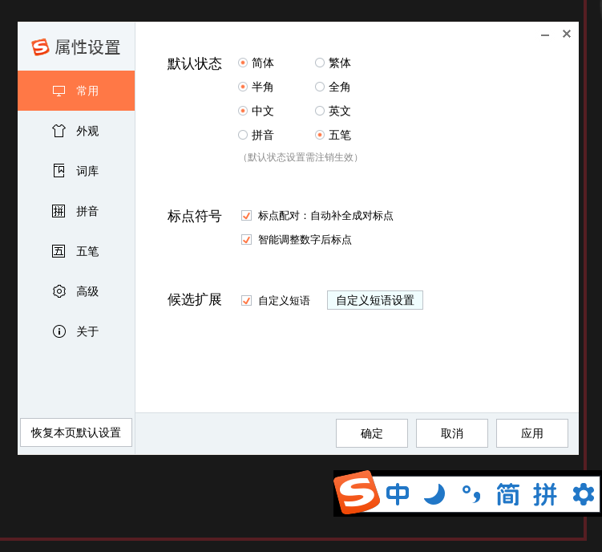
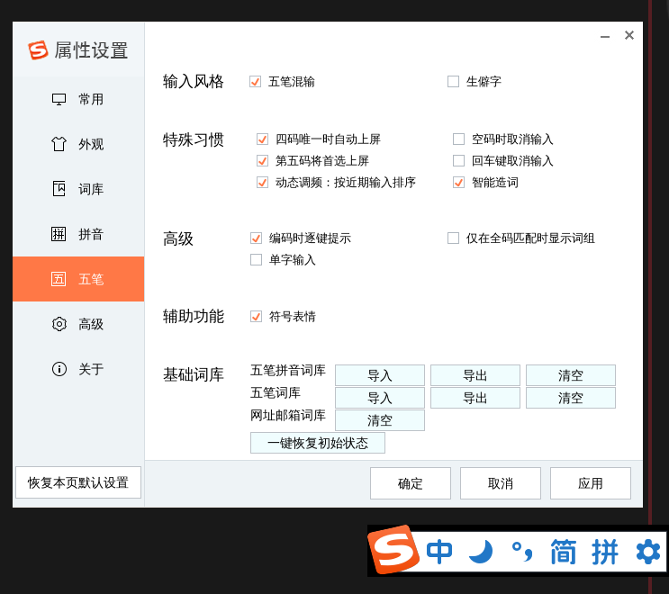
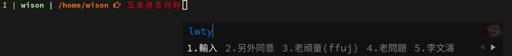

# Support chinese

- Install chinese input method

    ```bash
    sudo pacman -S fcitx fcitx-im fcitx-configtool
    ```

    After finishing, it will create an auto start desktop link in here:
    
    `/etc/xdg/autostart/fcitx-autostart.desktop`

</br>

- Add input method configuration file

    Put the following settings into `~/.xprofile`:

    ```bash
    export GTK_IM_MODULE=fcitx
    export QT_IM_MODULE=fcitx
    export XMODIFIERS="@im=fcitx"
    ```

</br>

- Auto start `fcitx` in your `i3` configuration

    `vim ~/.config/i3/config` and add the following settings:

    ```bash
    # Load chinese input method
    exec_always fcitx
    ```

    Make sure you reboot to take effect, or you can reboot after installing
    chinese fonts below.

</br>

- Install chinese fonts

    ```bash
    apk add font-isas-misc

    paru -S wqy-bitmapfont wqy-microhei \
        wqy-microhei-lite \
        wqy-zenhei \
        adobe-source-han-mono-cn-fonts \
        adobe-source-han-sans-cn-fonts \
        adobe-source-han-serif-cn-fonts
    ```

    Now, relogin to take effect.

</br>

- Install extra input methods

    If you need 仓颉、五笔等输入法

    ```bash
    sudo pacman -S fcitx-table-extra
    ```

    </br>

    If you need 搜狗拼音五笔混输

    ```bash
    # SouGou PinYin (it inclues WuBi)
    paru -S fcitx-sogoupinyin
    ```

    

</br>

- About the configuration

    After re-login, you should be able to see the `fcixt-configtool` icon shows on the bottom-right of your screen.
    Click on it, it will show a menu like below:

    

    Click on `configure`, then you will see the configuration UI below:

    

    If you don't see your installed input method, then click the left-bottom `+` button to add it.


    </br>

    The default shortcuts 
    - `Ctrl+Space`: Trigger input method. If you only install single input 
    method (`fcitx-sogoupinyin`), then it works like toggle chinese input method.

    - `Shirt+Ctrl+f`: Switch between `Traditional Chinese` and `Simplified Chinese`.

    

    </br>

    Press `Ctrl + Space`, you should able to see your input method, then you can configure it if you wanted:

    

    

    
