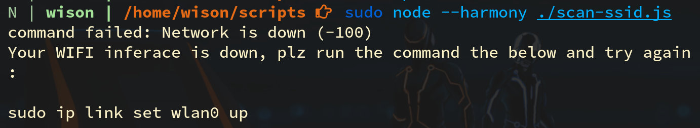
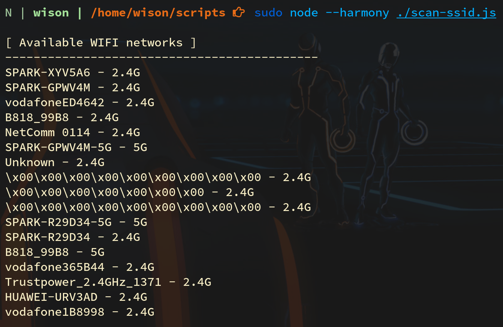

# WIFI Configuration

Right now, the newer `Arch Linux` can connect via **`ethernet`** NIC, but how about **`wireless`** NIC?

- Copy the WIFI config from example and named it as `wlan0-dhcp`

    ```bash
    cd /etc/netctl
    sudo cp -rvf examples/wireless-wpa ./wlan0-dhcp
    ```

</br>

- Edit `wlan0-dhcp` to change your WIFI `SSID` and `KEY` (encrypted password in HEX string)

    ```bash
    sudo vim wlan0-dhcp

    # Change the `ESSID` to your WIFI `SSID`
    
    # Go to the bottom, run the command below to read the 
    # `wpa_passphrase` result into current file.
    :r !wpa_passphrase YOUR_SSID_HERE YOUR_WIFI_PASSWORD_TEXT_HERE | grep psk
    
    # After that, you should get something like below:
    # #psk="xxxxx"
    # psk="XXXXXX" // That's encrypted WIFI PASS in HEX string
    # 
    # So you need to copy that "XXXX" hex string and make it looks like below
    # to set the `Key` value.
    # Make sure the value start with `\"` and then follow your HEX string
    Key=\"XXXXXX
    
    # Finally, enable the `Hidden=yes` line if your SSID is hidden.
    # Then save and exit
    ```

    Pay attention:

    _For connecting to the `5G` network, you need to match 2 conditions below:_

    - _You have to use unencrypted (plaintext) password to fill the `Key` field._

    - _The `5G` network needs to pick the `channel` to `40`._

    _**Otherwise, it won't work!!!**_

</br>

- Start connecting to WIFI

    Any file located at `/etc/netctl` folder is call `profile`,
    you can run the `netctl start PROFILE_NAME` to start any profile-based
    network configuration:

    ```bash
    sudo netctl start wlan0-dhcp
    ```

    If start fail, then run `sudo netctl status wlan0-dhcp` to read the detail error.

</br>

- Connect to WIFI when computer boots

    You can create a `systemd` service to connect to WIFI automatic when computer boots

    ```bash
    sudo netctl reenable wlan0-dhcp
    ```
    But this is not recommended if you're installing the `Arch Linux` to **USB**,
    as not all computers always have the `wlan0`. In the case which doesn't have the `wlan0` NIC,
    then the booting process will keep waiting before time out, it will waste a couple of seconds.

    For solving this, you can add a script to start `wlan0-dhcp` profile into a script which will 
    be added to **`lightdm`**, that will be perfect.


</br>

- Run the script to list all available networks

    - Install `node` if you don't have it yet:

        ```bash
        sudo pacman --sync --refresh nodejs-lts-erbium
        ```

        </br>

    - Create the `~/scripts/scan-ssid.js` with the following content:

        ```js
        const {execSync} = require('child_process')
        
        // Run the `iw` command to do a WIFI scan
        const cmd = `iw dev wlan0 scan | grep -e "freq:" -e "SSID:"`
        let cmdResult = ``
        try {
            cmdResult = execSync(cmd)
                .toString()
                .replace(/\t/g, '')
            // console.log(`cmdResult: ${cmdResult}`)
        }
        catch (error) {
            if (error.message && error.message.indexOf('Network is down') !== -1) {
                console.log(`Your WIFI inferace is down, plz run the command the below and try again: \n\nsudo ip link set wlan0 up\n`)
            }
        
            console.error(error)
            return;
        }
        
        
        // Format the result
        const resultList = []
        
        let lastWifiInfo = {freq: '', ssid: ''}
        const tempArr = cmdResult.split(`\n`)
            .forEach((tempString, index, arrRef) => {
                const isSsid = index % 2 == 1
        
                if (isSsid) {
                    let fixedSsid = tempString.replace(`SSID: `, ``).trim()
                    lastWifiInfo.ssid = Boolean(fixedSsid == ``) ? `Unknown` : fixedSsid
                    resultList.push(lastWifiInfo)
                } else {
                    let freqStr = tempString.replace(`freq: `, ``).trim()
                    let is5G = Boolean(parseInt(freqStr, 10) > 5100)
                    // console.log(`freqStr: ${freqStr}, is5G: ${is5G}`)
        
                    lastWifiInfo = {freq: '', ssid: ''}
                    lastWifiInfo.freq = is5G ? `5G` : `2.4G`
                }
            })
        
        let resultTable = `\n[ Available WIFI networks ]` +
            `\n--------------------------------------------\n` +
            resultList.map(wifiInfo => `${wifiInfo.ssid} - ${wifiInfo.freq}`)
                .join(`\n`) + `\n`
        
        console.log(resultTable)
        ```

        </br>

    - Run the script like below:

        ```bash
        sudo node --harmony ~/scripts/scan-ssid.js
        ```

        If you didn't up the `wlan0` interface, it will print out the error 
        like below:

         

        Then just run `sudo ip link set wlan0 up`, wait for a few seconds,
        then re-run the script command again. And it should print out like
        below:

         

