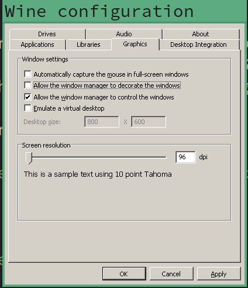
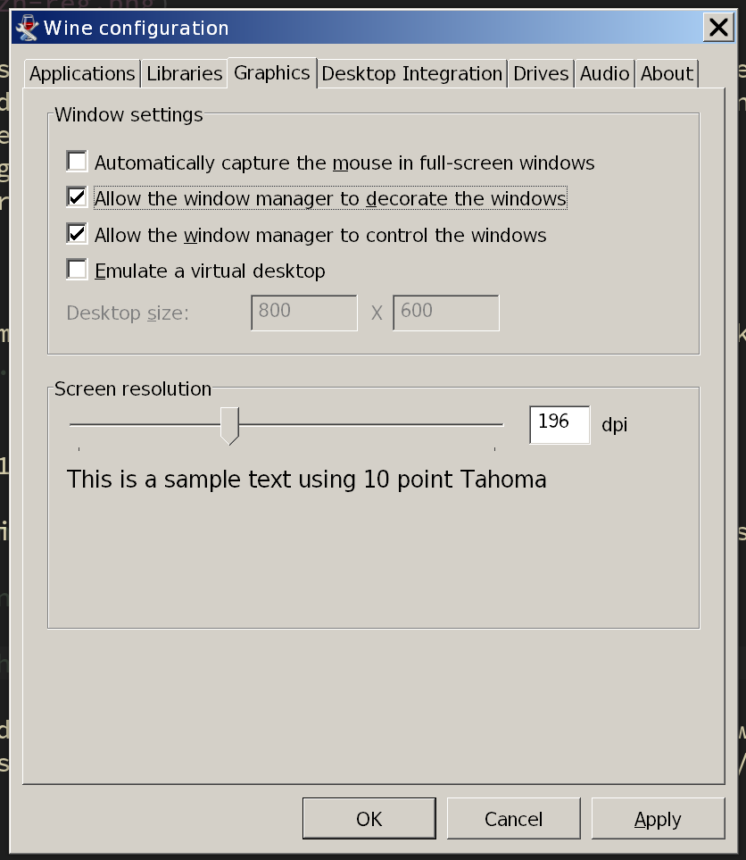
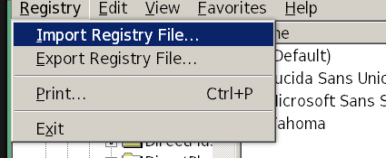
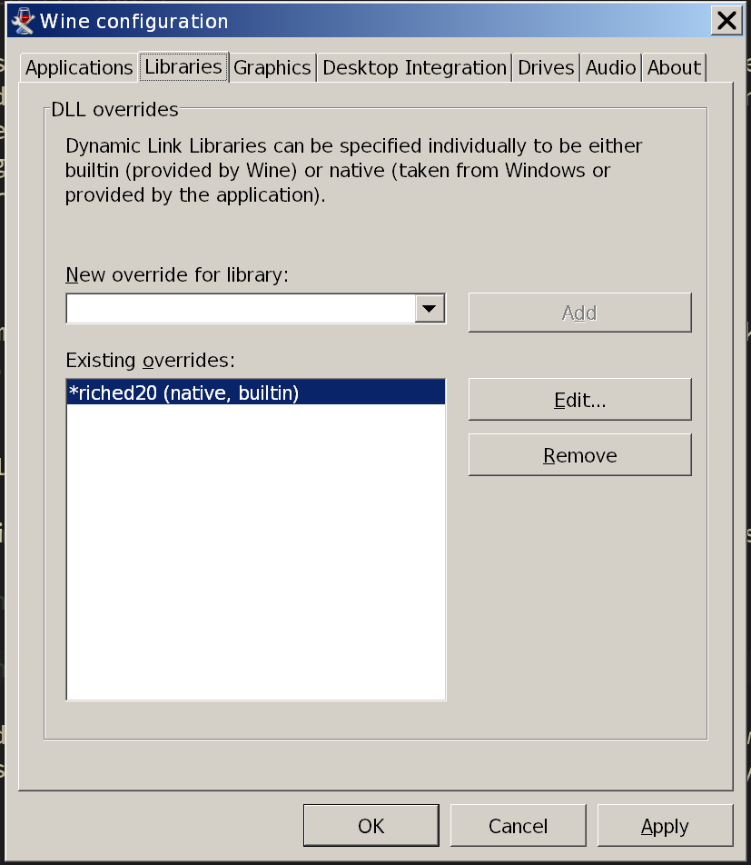

# Wine

What is **`Wine`**?

**Wine is not an Emulator.** It is a compatibility layer capable of running Windows applications. 
Wine translates Windows API into **`POSIX`** call on-the-fly, eliminating the performance and memory
penalties of other methods and allowing you to cleanly integrate Windows applicants into your desktop.

- Install **`wine`** from **`pacman`**.

    `sudo vim /etc/pacman.conf` and uncomment the lines below to enable the `multilib`:

    ```bash
    [multilib]
    Include = /etc/pacman.d/mirrorlist
    ```

    Sync the databse:

    ```bash
    sudo pacman -Sy
    ```

    Then install it:
    
    ```bash
    sudo pacman -S wine winetricks
    ```
    
    Run `winecfg` to create a default `C:/` in `$HOME/.wine/drive_c`.
    It will ask you to install some extra stuff, just click `cancel` for all of them,
    as it doesn't matter to run `wecaht`.

    ```bash
    winecfg
    ```

    </br>

    For the first time, you might see the UI looks like below (very tiny font):

    

    After you change the correct DPI, re-run `winecfg` again, it should look better:

    

</br>

- Link Chinese fonts to your local font

    Save the following content to a temporary file, you need to `import` it
    later, make sure NOT save into a `hidden` folder, as the `winecfg` program
    won't be able to see your `hidden` folder!!!
    
    For example, save to `~/zh.reg`:
    
    ```bash
    $ vim ~/zh.reg
    
    # You can find the font name in `/usr/share/fonts`, just replace "wqy-microhei.ttc"
    # to the one you like. e.g. "SourceHanSansCN-Medium.otf"
    
    REGEDIT4
    [HKEY_LOCAL_MACHINE\Software\Microsoft\Windows NT\CurrentVersion\FontLink\SystemLink]
    "Lucida Sans Unicode"="wqy-microhei.ttc"
    "Microsoft Sans Serif"="wqy-microhei.ttc"
    "Microsoft YaHei"="wqy-microhei.ttc"
    "微软雅黑"="wqy-microhei.ttc"
    "MS Sans Serif"="wqy-microhei.ttc"
    "Tahoma"="wqy-microhei.ttc" 
    "Tahoma Bold"="wqy-microhei.ttc"
    "SimSun"="wqy-microhei.ttc"
    "Arial"="wqy-microhei.ttc"
    "Arial Black"="wqy-microhei.ttc"
    "宋体"="wqy-microhei.ttc"
    "新細明體"="wqy-microhei.ttc"
    ```
    
    Run the command below to import `zh.reg`:
    
    ```bash
    wine regedit
    ```
    
    Then click `Import Registry File` and choose your `zh.reg`:
    
    

</br>

- Download `DLLs` by running `winetricks`

    ```bash
    winetricks riched20
    ```

    It will download the dependencies into `$HOME/.cache/winetricks` 
    then install it into `$HOME/.wine/drive_c`.

    Pay attention:

        If you can't download `W2KSP4_EN.EXE`, then you can download it from:

        http://www.mywindowspage.com/index.php/download/w2ksp4_en-exe/ 
        
        After downloaded, move it into `$HOME/.cache/winetricks/wine2ksp4/`,
        and then run `winetricks riches20` again


    After installed the `DLLs`, if you run `winecfg` again, you should be able 
    to see the `DLL` there:

    

</br>

- Install **`Wechat`** or **`WxWork`**

    Download the window version installation EXE from here, just pick the one you needed:

    - [WxWork](https://work.weixin.qq.com/#indexDownload)

    - [Wechat](https://weixin.qq.com/cgi-bin/readtemplate?uin=&stype=&promote=&fr=&lang=zh_CN&ADTAG=&check=false&nav=download&t=weixin_download_list&loc=readtemplate,weixin,body,6)

    After download, run the installation program you needed. Let's take the `WxWork` as example:

    ```bash
    # If you need `WxWork`
    wine $HOME/Downloads/WE_CHAT_WORK_EXE_FILE_NAME_HERE
    ```

    Then, you should be able to see the install UI like below:

    

    

    

    


</br>

- How to use `i3` keybinding to lanuch `WxWork`

    - Create lanuch script

        `vim ~/scripts/wechat_work.sh` with the following content:

        If you change the default installation folder, then you should change to yours!!!

        ```bash
        wine ~/.wine/drive_c/Program\ Files\ \(x86\)/WXWork/WXWork.exe &
        ```

        Make it executable:

        ```bash
        chmod +x ~/scripts/wechat_work.sh
        ```

    - `i3` keybinding

        `vim ~/.config/i3/config` and add the following keybinding to lanuch `WxWork`:

        ```bash
        # Launch WxWork
        bindsym $mod+w exec --no-startup-id ~/scripts/wechat_work.sh

        # Enable the floating mode for `WxWork` window 
        for_window [class="wxwork.exe"] floating enable border pixel 1
        ```

        A tips: 

        As `WxWork` runs in floating mode and its UI is bigger, for getting the better
        user experience, you might switch to a empty workspace to run the `WxWork`.

</br>

- How to remove `wine` and `winetricks` completely?

    If you don't like it, walk through the steps below to remove them completely:

    ```bash
    # Remove the package and all related dependencies
    sudo pacman -Rsn wine winetricks

    # Remove the entire `~/.wine`, as that's huge!!!
    rm -rf ~/.wine

    # Remove the cache as well
    rm -rf ~/.cache/winetricks/
    ```
